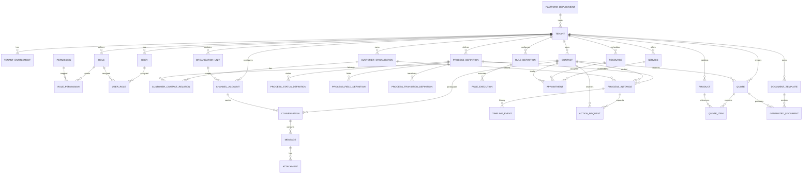
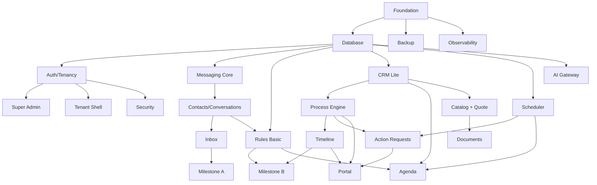

# Modelo de Datos, ERD Conceptual y Backlog Técnico del MVP

**Producto:** Plataforma Multitenant de Automatización Empresarial, Atención y Operaciones  
**Documento:** Especificación técnica derivada del PRD maestro  
**Versión:** 1.0  
**Fecha de corte:** 2026-08-12  
**Fuente normativa superior:** `PRD.md`  
**Estado:** Listo para implementación incremental del MVP  
**Objetivo principal:** convertir el PRD maestro en un modelo de datos y un backlog suficientemente precisos para que un desarrollador o una IA pueda comenzar a implementar sin volver a decidir la arquitectura conceptual.

---

# 0. Cómo usar este documento

Este documento no reemplaza el PRD maestro. Ambos deben leerse juntos.

Jerarquía documental:

1. `PRD.md` define **qué producto estamos construyendo y las decisiones conceptuales no negociables**.
2. Este documento define **cómo representar los conceptos principales en datos y en qué orden construir el MVP**.
3. `SYSTEM_DESIGN.md` deberá definir **cómo se ejecutan físicamente los servicios, límites, protocolos, topología, resiliencia, seguridad y escalamiento**.
4. Los ADR futuros documentarán decisiones técnicas específicas cuando existan alternativas razonables.
5. `CHANGELOG.md` registrará cambios de producto/release.
6. `.agents/skills/whatsapp-platform-engineering/SKILL.md` instruirá a cualquier IA/agente que trabaje en el repositorio.
7. Los runbooks definirán operación y recuperación.

Reglas:

- Si este documento contradice el PRD, prevalece el PRD hasta que un ADR/actualización explícita modifique ambos.
- No agregar una entidad sólo porque una pantalla la necesite. Primero confirmar si el concepto pertenece al dominio.
- No introducir referencias directas a clientes concretos en código o schema.
- Todo dato de negocio tenant-owned debe quedar tenant-scoped.
- PostgreSQL es fuente de verdad.
- Redis/BullMQ no son fuente de verdad de estados críticos.
- Toda automatización crítica debe poder reconstruirse a partir de PostgreSQL.
- El MVP debe priorizar un vertical slice vendible, no completar cada subsistema a profundidad antes de poder demostrar valor.

---

# 1. Objetivo técnico del MVP

El MVP debe permitir demostrar, vender y operar de manera controlada al menos estos escenarios:

## Escenario A — Automatización básica de WhatsApp

1. Super Admin crea tenant.
2. Activa módulos contratados.
3. Tenant crea usuarios.
4. Tenant conecta una cuenta WhatsApp mediante un provider habilitado.
5. Entra un mensaje.
6. La plataforma identifica o crea contacto.
7. Se crea/recupera conversación.
8. Una regla responde, clasifica o enruta.
9. Un humano puede responder desde el dashboard.
10. Un humano también puede responder desde el teléfono/dispositivo vinculado.
11. La conversación se sincroniza y distingue origen/actor.
12. Todo queda auditable.

## Escenario B — Consulta de proceso/estatus

1. Cliente pregunta por pedido, expediente, reparación, trámite u otro proceso.
2. La conversación identifica el proceso por una referencia segura.
3. La plataforma consulta PostgreSQL.
4. Responde estado y movimientos visibles al cliente.
5. El dato mostrado coincide con la misma fuente usada por dashboard y portal.

## Escenario C — Agenda

1. Cliente solicita cita/reservación.
2. Sistema consulta disponibilidad.
3. Captura datos mínimos.
4. Reserva.
5. Registra timeline.
6. Programa recordatorio.
7. Permite cancelar/reprogramar.
8. Humano puede intervenir.

## Escenario D — Action Request

1. Proceso requiere acción.
2. Se crea `ActionRequest`.
3. Cliente recibe solicitud por WhatsApp o portal.
4. Responde/sube archivo/acepta/rechaza.
5. La acción queda completada.
6. Una regla puede continuar el proceso.

## Escenario E — Cotización asistida

1. Cliente solicita productos/servicios.
2. Se crea quote draft.
3. Motor determinista calcula total, impuestos y reglas aplicables.
4. Documento se genera con branding/template.
5. Si reglas lo requieren, una persona aprueba.
6. Documento se envía.
7. Timeline y auditoría registran el flujo.

Estos cinco escenarios son suficientes para mostrar el valor transversal del producto a talleres, despachos, clínicas, escuelas, distribuidores, servicios técnicos, logística y otros nichos.

---

# 2. Principios de modelado de datos

## 2.1 Identificadores

Recomendación inicial:

- IDs primarios internos: UUID v7 o ULID, elegidos consistentemente en todo el proyecto.
- No usar secuencias globales como identificador expuesto.
- Numeraciones humanas (`Q-2026-000123`, expediente, ticket, cita) se almacenan separadas.
- IDs externos de providers nunca son PK internas.

Todos los identificadores tenant-owned deben impedir enumeración trivial.

## 2.2 Timestamps

Cada tabla mutable relevante deberá considerar:

- `created_at`
- `updated_at`

Agregar cuando aplique:

- `deleted_at`
- `archived_at`
- `disabled_at`
- `last_seen_at`
- `completed_at`
- `expires_at`

Todos almacenados en UTC. La timezone del tenant/Organization Unit se utiliza para presentación y reglas de negocio.

## 2.3 Soft delete

No usar soft delete indiscriminadamente.

Usar `deleted_at` donde recuperar/referenciar información histórica tenga valor y el borrado legal lo permita.

Entidades históricas como:

- Message
- AuditLog
- TimelineEvent
- RuleExecution
- QuoteVersion

no deben “desaparecer” por una eliminación normal. Deben seguir políticas específicas de retención.

## 2.4 Tenant isolation

Toda entidad tenant-owned tendrá `tenant_id NOT NULL`.

Excepciones:

- catálogos globales de plataforma;
- definición global de permisos;
- releases;
- deployments administrados a nivel plataforma;
- plantillas globales publicadas por nosotros.

Reglas de acceso:

1. Resolver `tenant_id` desde la sesión/autenticación.
2. Nunca confiar en un `tenant_id` arbitrario enviado por el cliente.
3. Toda query de repositorio tenant-owned debe filtrar por tenant.
4. Debe haber pruebas automatizadas de aislamiento.
5. Cuando sea compatible con Prisma/stack elegido, evaluar RLS en PostgreSQL como defensa adicional, no como sustituto de controles de aplicación.

## 2.5 JSONB

Usar JSONB para:

- configuración extensible;
- snapshots;
- custom field values;
- metadata de providers;
- payloads de webhook;
- condiciones/acciones de rules.

No usar JSONB para evitar modelar relaciones centrales.

## 2.6 Versionado de definiciones

Las definiciones configurables importantes deben versionarse cuando una modificación pueda alterar procesos existentes:

- ProcessDefinition
- DocumentTemplate
- FormDefinition
- RuleDefinition cuando sea necesario reproducir ejecuciones
- IndustryTemplate

Una instancia activa debe conservar la versión con la que fue creada cuando cambiar la definición pudiera modificar semántica histórica.

## 2.7 Integridad referencial

Preferir FK reales en dominios internos.

No usar relaciones polimórficas sin necesidad. Cuando una relación genérica sea indispensable, utilizar:

- `entity_type`
- `entity_id`

pero limitarla a subsistemas explícitamente genéricos como Timeline/Attachments y envolverla con validación de dominio.

---

# 3. Convenciones de naming

Código y DB en inglés para consistencia técnica.

Ejemplos:

- `tenant`
- `organization_unit`
- `channel_account`
- `conversation`
- `process_definition`
- `process_instance`
- `action_request`

UI y documentación comercial pueden estar en español.

Estados de negocio configurables no se hardcodean.

Evitar términos ambiguos como `client` en código porque puede significar consumidor HTTP o cliente comercial. Usar:

- `tenant` para empresa que compra nuestra plataforma.
- `customer_organization` para empresa que es cliente del tenant.
- `contact` para persona.
- `end_customer` sólo en documentación cuando necesitemos hablar genéricamente.

---

# 4. ERD conceptual de alto nivel



Este diagrama es conceptual. `SYSTEM_DESIGN.md` y las migraciones definirán detalles físicos definitivos.

---

# 5. Plataforma, deployment y tenants

## 5.1 `platform_deployment`

Representa una instalación ejecutable del producto.

Campos mínimos:

| Campo | Tipo conceptual | Requerido | Notas |
|---|---|---:|---|
| id | UUID/ULID | sí | |
| name | string | sí | Identificación interna |
| mode | enum | sí | `shared`, `dedicated`, `customer_hosted` |
| environment | enum | sí | `production`, `staging`, `development` |
| current_version | string | sí | versión desplegada |
| target_version | string nullable | no | actualización pendiente |
| release_channel | enum | sí | `stable`, `candidate`, `beta` |
| status | enum | sí | `healthy`, `degraded`, `offline`, `maintenance` |
| base_url | string nullable | no | URL administrativa |
| metadata | jsonb | no | host/region sin secrets |
| last_health_at | timestamp | no | |
| created_at | timestamp | sí | |
| updated_at | timestamp | sí | |

No almacenar secretos de infraestructura sin cifrado.

## 5.2 `tenant`

Campos mínimos:

| Campo | Tipo |
|---|---|
| id | UUID |
| deployment_id | FK nullable según modelo |
| legal_name | string |
| display_name | string |
| slug | string |
| status | enum |
| default_timezone | string IANA |
| default_locale | string |
| default_currency | string ISO |
| branding_config | jsonb |
| settings | jsonb |
| created_at | timestamp |
| updated_at | timestamp |
| suspended_at | timestamp nullable |

`status`:

- `provisioning`
- `active`
- `suspended`
- `offboarding`
- `archived`

Índices:

- unique global/por deployment sobre `slug`
- index `status`
- index `deployment_id`

## 5.3 `tenant_entitlement`

No confundir “módulo habilitado” con feature flag de rollout.

Campos:

- `id`
- `tenant_id`
- `entitlement_key`
- `enabled`
- `limit_value` nullable
- `config` JSONB
- `starts_at` nullable
- `ends_at` nullable
- `source` (`plan`, `manual_override`, `trial`, `contract`)
- `created_at`
- `updated_at`

Ejemplos de keys:

```text
module.messaging.basic
module.automation.basic
module.automation.advanced
module.appointments
module.quotes
module.catalog
module.customer_portal
module.documents
module.ai
module.integrations
module.white_label

limit.channel_accounts
limit.users
limit.organization_units
limit.storage_bytes
limit.monthly_ai_budget
```

Regla:

- UI oculta/restringe módulo.
- API vuelve a validar entitlement.
- Workers vuelven a validar entitlement para acciones que generan costo/riesgo.
- Deshabilitar módulo no borra sus datos.

## 5.4 `platform_feature_flag`

Feature rollout técnico, no comercial.

Campos:

- `key`
- `enabled_globally`
- `rollout_config`
- `created_at`
- `updated_at`

Puede permitir lista de tenants, porcentajes o deployment channels.

---

# 6. Organization Units

## 6.1 `organization_unit`

Entidad jerárquica para sucursales, departamentos o áreas.

Campos:

- `id`
- `tenant_id`
- `parent_id` nullable FK a misma tabla
- `type` (`company`, `branch`, `department`, `team`, `other`)
- `name`
- `code` nullable
- `timezone` nullable; hereda tenant
- `business_hours_id` nullable
- `address` JSONB nullable
- `settings` JSONB
- `active`
- timestamps

Reglas:

- árbol sin ciclos;
- profundidad razonable configurable;
- los objetos scoped pueden heredar desde ancestros;
- una unidad no puede apuntar a parent de otro tenant.

Casos:

```text
Tenant
└── León
    ├── Ventas
    ├── Soporte
    └── Cobranza
```

o:

```text
Tenant
└── Sucursal Centro
    ├── Recepción
    └── Ortodoncia
```

## 6.2 `user_organization_unit`

Campos:

- `tenant_id`
- `user_id`
- `organization_unit_id`
- `scope_role` nullable
- `is_primary`
- timestamps

Permite que un usuario tenga alcance en una o varias unidades.

---

# 7. Identidad, usuarios, roles y permisos

## 7.1 `user`

Campos:

- `id`
- `tenant_id` nullable sólo para Platform Admins si se separan en tabla común
- `email`
- `password_hash` o referencia a provider de identidad
- `display_name`
- `status`
- `locale`
- `timezone`
- `last_login_at`
- `mfa_state`
- timestamps

Recomendación: mantener Platform Admin y Tenant User claramente distinguibles. Si comparten tabla, un campo `account_scope` debe impedir confusiones.

## 7.2 `role`

Campos:

- `id`
- `tenant_id` nullable para roles template globales
- `name`
- `key`
- `description`
- `is_system`
- timestamps

Roles iniciales tenant:

- Owner
- Administrator
- Supervisor
- Agent
- Operator
- Viewer

No depender sólo de esos nombres; usar permisos granulares.

## 7.3 `permission`

Catálogo global versionado en código/seed:

Ejemplos:

```text
tenant.settings.manage
tenant.users.manage
tenant.roles.manage
channels.read
channels.manage
conversations.read
conversations.reply
conversations.assign
processes.read
processes.create
processes.update
processes.transition
action_requests.read
action_requests.manage
appointments.read
appointments.manage
quotes.read
quotes.create
quotes.approve
quotes.send
catalog.read
catalog.manage
rules.read
rules.manage
ai.settings.manage
integrations.manage
reports.read
audit.read
exports.create
```

## 7.4 `user_role`

- `tenant_id`
- `user_id`
- `role_id`
- `organization_unit_id` nullable
- timestamps

## 7.5 `role_permission`

- `role_id`
- `permission_id`
- optional scope constraints

## 7.6 Sesiones

`user_session` recomendado:

- `id`
- `user_id`
- `tenant_id`
- `device_label`
- `ip_hash` o metadata según privacidad
- `created_at`
- `last_seen_at`
- `expires_at`
- `revoked_at`

---

# 8. Contacts y CRM ligero

## 8.1 `contact`

Persona única dentro del tenant.

Campos:

- `id`
- `tenant_id`
- `display_name`
- `first_name`
- `last_name`
- `preferred_name`
- `status`
- `owner_user_id` nullable
- `primary_organization_id` nullable
- `custom_values` JSONB
- `notes_summary` nullable
- timestamps

Índices:

- `tenant_id`
- `(tenant_id, owner_user_id)`
- búsquedas normalizadas de nombre

## 8.2 `contact_point`

Identidad omnicanal.

Campos:

- `id`
- `tenant_id`
- `contact_id`
- `type` (`phone`, `whatsapp`, `email`, `portal`, `external_id`)
- `value`
- `normalized_value`
- `verified_at`
- `is_primary`
- `metadata`
- timestamps

Unique parcial recomendado según tipo/tenant para evitar duplicados evidentes, teniendo cuidado con números compartidos.

## 8.3 `customer_organization`

Empresa/organización que es cliente del tenant.

Campos:

- `id`
- `tenant_id`
- `name`
- `legal_name`
- `tax_id` nullable
- `status`
- `owner_user_id`
- `custom_values`
- timestamps

## 8.4 `customer_contact_relation`

- `tenant_id`
- `customer_organization_id`
- `contact_id`
- `role_title`
- `is_primary`
- timestamps

## 8.5 `contact_tag` / `tag`

MVP opcional pero conveniente:

- `tag` tenant-scoped
- `contact_tag` join table

## 8.6 Deduplicación

MVP:

- normalizar teléfono E.164 cuando sea posible;
- normalizar email lower-case;
- sugerir merge, no auto-merge agresivo;
- conservar audit trail de merges.

---

# 9. Channel Engine y WhatsApp

## 9.1 `channel_account`

Representa cada cuenta/canal conectado.

Campos:

- `id`
- `tenant_id`
- `organization_unit_id` nullable
- `channel_type` (`whatsapp`, future)
- `provider_type` (`baileys`, `wppconnect`, `meta`)
- `display_name`
- `external_account_id` nullable
- `phone_number` nullable
- `status`
- `automation_default_mode`
- `credentials_ref` / encrypted payload
- `provider_config` JSONB cifrado donde aplique
- `last_connected_at`
- `last_disconnected_at`
- `last_error_code`
- `last_error_at`
- `health_status`
- timestamps

Estados sugeridos:

- `not_configured`
- `pairing`
- `connected`
- `reconnecting`
- `disconnected`
- `error`
- `disabled`

Reglas:

- validar `limit.channel_accounts`;
- el tenant puede agregar/eliminar/revincular si tiene permiso;
- Super Admin puede inspeccionar salud y desactivar;
- una cuenta puede asociarse a branch/department.

## 9.2 `channel_session_state`

Si se separa del account:

- `channel_account_id`
- encrypted provider auth state
- `schema_version`
- `updated_at`

No exponer en API normal.

## 9.3 Provider abstraction

Contrato mínimo:

```ts
interface MessagingProvider {
  connect(accountId: string): Promise<ConnectionResult>;
  disconnect(accountId: string): Promise<void>;
  getConnectionState(accountId: string): Promise<ConnectionState>;
  sendMessage(input: SendMessageInput): Promise<ProviderMessageResult>;
  markRead?(input: MarkReadInput): Promise<void>;
  downloadMedia?(input: MediaRef): Promise<Readable>;
  normalizeInboundEvent(event: unknown): Promise<NormalizedChannelEvent[]>;
}
```

No asumir que auth state es portable entre providers.

---

# 10. Conversations, Messages y Inbox

## 10.1 `conversation`

Campos:

- `id`
- `tenant_id`
- `channel_account_id`
- `contact_id`
- `organization_unit_id` nullable
- `status`
- `automation_mode`
- `assigned_user_id` nullable
- `assigned_team_unit_id` nullable
- `priority`
- `subject` nullable
- `provider_thread_id` nullable
- `last_message_at`
- `last_inbound_at`
- `last_outbound_at`
- `human_takeover_until` nullable
- `closed_at` nullable
- timestamps

Estados:

- `new`
- `open`
- `pending`
- `closed`

Inbox views derivadas:

- Nuevo
- Bot atendiendo
- Requiere humano
- Asignado a mí
- Pendiente
- Cerrado

No convertir esos filtros en estados incompatibles entre sí.

## 10.2 `message`

Campos:

- `id`
- `tenant_id`
- `conversation_id`
- `channel_account_id`
- `contact_id` nullable
- `direction` (`inbound`, `outbound`)
- `origin`
- `actor_type`
- `actor_id` nullable
- `provider_message_id`
- `provider_timestamp`
- `message_type`
- `text_body` nullable
- `structured_payload` JSONB nullable
- `reply_to_message_id` nullable
- `delivery_status`
- `idempotency_key` nullable
- `metadata`
- timestamps

`origin`:

- `customer`
- `human_app`
- `human_external_device`
- `bot_rule`
- `bot_ai`
- `automation`
- `integration`
- `system`

`actor_type`:

- `contact`
- `user`
- `automation`
- `ai`
- `system`
- `external_human_unknown`

Regla crítica:

Cuando nuestra plataforma envía un mensaje y después el provider emite un echo `fromMe`, debe correlacionarse con el registro existente, no crear un segundo mensaje.

## 10.3 `message_delivery_event`

Recomendado:

- `message_id`
- `status` (`queued`, `sent`, `delivered`, `read`, `failed`)
- provider timestamp
- error code
- metadata

## 10.4 `attachment`

Campos:

- `id`
- `tenant_id`
- `message_id` nullable
- `entity_type` nullable
- `entity_id` nullable
- `storage_key`
- `original_filename`
- `mime_type`
- `size_bytes`
- `sha256`
- `scan_status`
- `created_by_actor`
- timestamps

## 10.5 Human takeover

Al detectar `human_external_device`:

- registrar mensaje;
- aplicar policy de tenant;
- opcionalmente cambiar `automation_mode` o `human_takeover_until`;
- nunca borrar contexto;
- evitar que bot compita con humano.

---

# 11. Process Engine

## 11.1 `process_definition`

Campos:

- `id`
- `tenant_id`
- `key`
- `name`
- `description`
- `version`
- `status` (`draft`, `published`, `archived`)
- `icon`
- `display_config`
- `settings`
- timestamps

Ejemplos:

- Order
- Case
- Repair
- Enrollment
- Shipment
- Procedure

## 11.2 `process_field_definition`

Campos:

- `id`
- `tenant_id`
- `process_definition_id`
- `key`
- `label`
- `field_type`
- `required`
- `searchable`
- `customer_visible`
- `validation_config`
- `options_config`
- `display_order`
- timestamps

Tipos:

- text
- long_text
- integer
- decimal
- currency
- date
- datetime
- boolean
- select
- multi_select
- phone
- email
- url
- reference
- file
- image
- user
- contact
- organization

## 11.3 `process_status_definition`

Campos:

- `id`
- `process_definition_id`
- `key`
- `label`
- `category` (`open`, `pending`, `completed`, `cancelled`)
- `customer_label` nullable
- `customer_visible`
- `color_token`
- `is_initial`
- `is_terminal`
- `display_order`

Sólo uno `is_initial=true` por definición/version.

## 11.4 `process_transition_definition`

- `id`
- `process_definition_id`
- `from_status_id`
- `to_status_id`
- `label`
- `permission_key` nullable
- `guard_config` JSONB
- `requires_reason`
- `requires_approval`
- timestamps

## 11.5 `process_instance`

Campos:

- `id`
- `tenant_id`
- `process_definition_id`
- `process_definition_version`
- `reference_number`
- `title`
- `status_definition_id`
- `contact_id` nullable
- `customer_organization_id` nullable
- `organization_unit_id` nullable
- `owner_user_id` nullable
- `assigned_user_id` nullable
- `priority`
- `custom_values` JSONB
- `customer_visibility`
- `opened_at`
- `due_at` nullable
- `completed_at` nullable
- timestamps

Índices:

- unique `(tenant_id, process_definition_id, reference_number)`
- `(tenant_id, status_definition_id)`
- `(tenant_id, contact_id)`
- `(tenant_id, customer_organization_id)`
- `(tenant_id, organization_unit_id)`
- búsqueda por fields específicos cuando se identifiquen patrones frecuentes.

## 11.6 `process_relation`

Permite relacionar:

- pedido con cotización
- reparación con vehículo futuro
- expediente con cita
- shipment con quote

Campos:

- `tenant_id`
- `from_process_instance_id`
- `relation_type`
- `to_entity_type`
- `to_entity_id`

## 11.7 Cambio de estado

Toda transición debe:

1. cargar instancia con tenant scope;
2. verificar permiso;
3. verificar guard;
4. iniciar transacción;
5. actualizar estado;
6. crear TimelineEvent;
7. crear AuditLog;
8. insertar DomainEvent/outbox;
9. commit;
10. workers procesan reglas/notificaciones.

No ejecutar acciones externas irreversibles dentro de la transacción de DB.

---

# 12. Timeline Engine

## 12.1 `timeline_event`

Campos:

- `id`
- `tenant_id`
- `entity_type`
- `entity_id`
- `event_type`
- `title`
- `description`
- `visibility`
- `actor_type`
- `actor_id` nullable
- `source`
- `data` JSONB
- `occurred_at`
- `created_at`

`visibility`:

- `internal`
- `customer`
- `both`

Regla:

- Timeline explica historia de negocio al humano.
- AuditLog explica quién cambió qué a nivel control.
- No son la misma tabla.

Eventos no se editan salvo corrección administrativa explícita; preferir evento compensatorio.

---

# 13. Action Request

## 13.1 `action_request`

Campos:

- `id`
- `tenant_id`
- `process_instance_id` nullable
- `conversation_id` nullable
- `recipient_type`
- `recipient_contact_id` nullable
- `recipient_user_id` nullable
- `recipient_role_id` nullable
- `recipient_unit_id` nullable
- `type`
- `title`
- `description`
- `status`
- `due_at` nullable
- `expires_at` nullable
- `visibility`
- `completion_policy`
- `token_version`
- `completed_at` nullable
- `completed_by_type` nullable
- `completed_by_id` nullable
- metadata
- timestamps

Tipos iniciales:

- `upload_document`
- `confirm`
- `approve`
- `reject_or_approve`
- `provide_information`
- `select_option`
- `schedule`
- `payment_reference`
- `signature` futuro

Estados:

- `pending`
- `in_progress`
- `completed`
- `rejected`
- `expired`
- `cancelled`

## 13.2 `action_request_item`

Para solicitudes de múltiples datos/documentos:

- `action_request_id`
- `key`
- `label`
- `item_type`
- `required`
- `status`
- `value` JSONB
- timestamps

## 13.3 Resolución

Debe poder resolverse mediante:

- dashboard;
- WhatsApp;
- portal;
- link firmado;
- formulario.

Todas las superficies llaman al mismo application service.

---

# 14. Rules Engine

## 14.1 `rule_definition`

Campos:

- `id`
- `tenant_id`
- `organization_unit_id` nullable
- `name`
- `description`
- `status`
- `trigger_type`
- `trigger_config`
- `conditions`
- `actions`
- `priority`
- `stop_processing`
- `version`
- `last_published_at`
- timestamps

Triggers MVP:

- message.received
- conversation.created
- conversation.human_takeover
- process.created
- process.status_changed
- action_request.created
- action_request.completed
- appointment.created
- appointment.updated
- quote.created
- quote.approved
- scheduled.time_reached

Condiciones:

- equality;
- inequality;
- contains;
- starts/ends;
- existence;
- numeric/date comparison;
- status;
- unit;
- tag;
- channel;
- business hours;
- custom field.

Acciones:

- send_message;
- set_conversation_mode;
- assign_user/unit;
- create/update_process;
- transition_process;
- create_action_request;
- schedule_action;
- notify_user;
- create_appointment;
- create_quote_draft;
- call_integration futuro/controlado.

## 14.2 `rule_execution`

Campos:

- `id`
- `tenant_id`
- `rule_definition_id`
- `rule_version`
- `trigger_event_id`
- `idempotency_key`
- `status`
- `started_at`
- `completed_at`
- `error_code`
- `error_message_sanitized`
- `result_summary`
- `trace_id`

## 14.3 Seguridad

Builder no puede permitir ejecución arbitraria de código en MVP.

Actions deben provenir de un catálogo permitido.

---

# 15. Workflow orchestration y scheduled work

## 15.1 `scheduled_job_reference`

PostgreSQL conserva intención durable:

- `id`
- `tenant_id`
- `job_type`
- `entity_type`
- `entity_id`
- `run_at`
- `status`
- `payload`
- `idempotency_key`
- `queue_job_id` nullable
- `attempt_count`
- `last_error`
- timestamps

BullMQ puede reconstruirse consultando trabajos `pending` si Redis se pierde.

## 15.2 Interface

Ningún módulo debe usar BullMQ directamente fuera del adapter.

```ts
interface WorkflowOrchestrator {
  enqueue(input: EnqueueInput): Promise<WorkflowRef>;
  schedule(input: ScheduleInput): Promise<WorkflowRef>;
  cancel(ref: WorkflowRef): Promise<void>;
  signal?(ref: WorkflowRef, signal: WorkflowSignal): Promise<void>;
  getStatus(ref: WorkflowRef): Promise<WorkflowStatus>;
}
```

MVP adapter: BullMQ.

Futuro adapter: Temporal.

## 15.3 Idempotencia

Acciones externas deben usar `idempotency_key`.

Ejemplos:

```text
send-message:{messageId}
send-quote:{quoteId}:{quoteVersion}
appointment-reminder:{appointmentId}:24h
action-request-reminder:{requestId}:1
```

---

# 16. Appointments

## 16.1 `service`

- tenant_id
- organization_unit_id nullable
- name
- description
- duration_minutes
- buffer_before_minutes
- buffer_after_minutes
- price nullable
- active
- settings

## 16.2 `resource`

Puede ser persona, consultorio, mesa, sala, equipo.

- tenant_id
- organization_unit_id
- type
- name
- user_id nullable
- capacity
- active
- metadata

## 16.3 `availability_rule`

- tenant_id
- resource_id
- day_of_week
- start_local_time
- end_local_time
- timezone
- effective_from/to
- capacity

## 16.4 `availability_exception`

- resource_id
- starts_at
- ends_at
- type (`blocked`, `extra_availability`)
- reason

## 16.5 `appointment`

- id
- tenant_id
- organization_unit_id
- contact_id
- service_id
- resource_id nullable
- status
- starts_at
- ends_at
- timezone_snapshot
- source
- notes
- confirmation_status
- process_instance_id nullable
- timestamps

Estados:

- requested
- confirmed
- cancelled
- completed
- no_show
- rescheduled

No permitir double booking salvo que resource.capacity > 1.

---

# 17. Catalog

## 17.1 `product`

MVP:

- id
- tenant_id
- organization_unit_id nullable
- sku
- name
- description
- category
- price
- currency
- tax_code/config
- active
- custom_values
- timestamps

No implementar inventario complejo en MVP.

## 17.2 `service` vs `product`

`service` para agenda puede existir separado de `product` inicialmente. Antes de duplicar lógica comercial futura, evaluar un modelo `catalog_item`. No bloquear MVP por esta unificación.

---

# 18. Quote Engine

## 18.1 `quote`

Campos:

- id
- tenant_id
- organization_unit_id
- number
- contact_id
- customer_organization_id nullable
- status
- autonomy_level_snapshot
- currency
- subtotal
- discount_total
- tax_total
- shipping_total
- total
- valid_until
- terms
- notes
- created_by_type
- created_by_id
- approved_by_user_id nullable
- approved_at nullable
- sent_at nullable
- accepted_at nullable
- rejected_at nullable
- current_version
- timestamps

Estados:

- draft
- pending_approval
- approved
- sent
- accepted
- rejected
- expired
- cancelled

## 18.2 `quote_item`

- quote_id
- line_number
- product_id nullable
- sku_snapshot
- description_snapshot
- quantity
- unit
- unit_price
- discount
- tax
- line_total
- metadata

Siempre snapshot de información comercial relevante.

## 18.3 `quote_version`

Recomendado desde V1 para reproducibilidad:

- quote_id
- version
- snapshot JSONB
- created_by
- created_at

## 18.4 `quote_policy`

Tenant/config o tabla:

- autonomy_level
- max_auto_send_amount
- max_discount_percent
- min_margin_percent nullable
- require_stock
- new_customer_requires_approval
- exceptional_product_requires_approval
- policies JSONB

Regla:

IA nunca decide precio, impuesto o descuento final. Puede interpretar entrada o sugerir matching.

---

# 19. Document Engine

## 19.1 `document_template`

- id
- tenant_id nullable para templates globales
- template_type
- name
- theme_key
- version
- status
- html_template
- css_template
- schema
- assets
- default_config
- timestamps

10 temas iniciales profesionales, no 10 forks funcionales.

## 19.2 `generated_document`

- id
- tenant_id
- template_id
- template_version
- entity_type
- entity_id
- storage_key
- sha256
- render_snapshot
- generated_by_type
- generated_by_id
- status
- timestamps

Una quote enviada debe apuntar al PDF exacto generado.

---

# 20. Customer Portal

## 20.1 `portal_account`

Si se habilita login persistente:

- tenant_id
- contact_id
- email/phone identity
- auth state
- last_login_at
- status

## 20.2 `portal_access_grant`

Para links temporales:

- tenant_id
- contact_id
- entity_type
- entity_id
- scope
- token_hash
- expires_at
- consumed_at nullable
- revoked_at nullable

Nunca almacenar token plaintext.

## 20.3 Visibilidad

Portal sólo muestra:

- fields customer_visible;
- statuses customer_visible;
- TimelineEvents `customer|both`;
- documents explícitamente publicables;
- ActionRequests dirigidos al contacto.

---

# 21. AI Gateway

## 21.1 `ai_provider`

Puede ser platform-global y/o tenant-specific según política:

- id
- scope
- provider_type
- display_name
- endpoint
- enabled
- policy
- health
- timestamps

## 21.2 `ai_credential`

- provider_id
- tenant_id nullable
- encrypted_secret
- priority
- status
- cooldown_until
- last_error
- usage_metadata
- timestamps

No registrar API key en logs.

## 21.3 `ai_model_route`

- task_type
- provider/model
- priority
- data_classification_allowed
- max_cost
- enabled
- constraints

## 21.4 `ai_execution`

Registrar metadatos, no necesariamente prompt completo:

- tenant_id
- task_type
- provider
- model
- status
- latency
- token/usage metrics
- estimated_cost
- data_classification
- redaction_applied
- error
- trace_id

Contenido sensible sólo bajo política explícita y condiciones del proveedor.

---

# 22. Integrations

## 22.1 `integration_connection`

- tenant_id
- organization_unit_id nullable
- integration_type
- status
- encrypted_credentials
- config
- last_health_at
- last_error
- timestamps

## 22.2 `webhook_endpoint`

- tenant_id
- url
- encrypted_secret
- subscribed_events
- enabled
- timestamps

## 22.3 `webhook_delivery`

- endpoint_id
- event_id
- status
- attempt
- response_code
- next_attempt_at
- error
- timestamps

---

# 23. Audit y Domain Events

## 23.1 `audit_log`

Append-only lógico.

Campos:

- id
- tenant_id nullable para plataforma
- actor_type
- actor_id
- action
- entity_type
- entity_id
- organization_unit_id nullable
- before_summary JSONB nullable
- after_summary JSONB nullable
- request_id
- ip metadata sanitizada
- occurred_at

No guardar secrets.

## 23.2 `domain_event_outbox`

Outbox pattern recomendado desde MVP para evitar perder eventos entre transacción y queue.

Campos:

- id
- tenant_id
- event_type
- aggregate_type
- aggregate_id
- payload
- occurred_at
- published_at nullable
- attempts
- last_error

Transacción de dominio inserta outbox.

Un publisher consume y publica a BullMQ/event bus.

Esto será importante para futura migración a Temporal/event bus más sofisticado.

---

# 24. Notifications

## 24.1 `notification`

Interna a usuarios:

- tenant_id
- user_id
- type
- title
- body
- entity_type/id
- read_at
- timestamps

## 24.2 `notification_preference`

- user/contact
- event key
- channel
- enabled
- schedule/policy

MVP puede limitarse a preferencias internas esenciales.

---

# 25. Business Hours

## 25.1 `business_hours`

- tenant_id
- name
- timezone
- settings

## 25.2 `business_hours_period`

- day_of_week
- start_time
- end_time

## 25.3 `business_hours_exception`

- date
- closed / custom hours
- reason

Usado por:

- auto replies;
- SLA;
- agenda;
- rules;
- escalations.

---

# 26. Configuration precedence

Orden recomendado:

```text
Platform defaults
    ↓
Industry template defaults
    ↓
Tenant settings
    ↓
Organization Unit overrides
    ↓
Specific object/rule overrides
```

No duplicar configuración sin necesidad.

Cualquier sistema de configuración debe indicar de dónde provino el valor efectivo.

---

# 27. Industry Templates

## 27.1 `industry_template`

Puede vivir como contenido versionado del producto.

Incluye:

- modules recommended;
- process definitions;
- statuses;
- fields;
- rules;
- dashboard widgets;
- document theme recommendation;
- default quick replies;
- suggested portal visibility.

Al aplicar template a tenant:

- copiar/instanciar configuraciones a tenant;
- registrar template version;
- permitir que tenant modifique;
- futuras actualizaciones no deben sobrescribir personalizaciones automáticamente.

---

# 28. Relación entre Module Entitlements y datos

Regla de producto:

Desactivar módulo:

1. impide nuevas operaciones;
2. conserva datos;
3. workers dejan de ejecutar acciones específicas del módulo;
4. APIs devuelven error de entitlement;
5. UI oculta/indica módulo no contratado;
6. Super Admin puede reactivar y recuperar el estado previo.

No hacer drop/delete de tablas o filas por bajar de plan.

---

# 29. Principales constraints de DB

Como mínimo:

- FK tenant-consistent validada en application/domain layer.
- Unique `(tenant_id, normalized contact point)` donde sea seguro.
- Unique `(tenant_id, channel_type, provider_type, external_account_id)` cuando exista.
- Unique `(channel_account_id, provider_message_id)` para deduplicación.
- Unique `(tenant_id, process_definition_id, reference_number)`.
- Unique `(tenant_id, quote.number)`.
- Unique `(rule_definition_id, trigger_event_id)` o idempotency key apropiada.
- Unique `domain_event_outbox.id`.
- Check de fechas `ends_at > starts_at`.
- Check de cantidades/precios no negativos donde corresponda.
- No double initial state por process definition/version.

---

# 30. Estrategia de búsqueda

MVP:

- índices PostgreSQL normales;
- `pg_trgm` para nombre/teléfono/texto cuando sea útil;
- búsqueda por reference_number;
- filtros por estado, unidad, owner.

No incorporar Elasticsearch/OpenSearch en MVP.

Futuro:

- full-text;
- vector/semantic search para conocimiento, no para consistencia de negocio.

---

# 31. Estrategia de migraciones

1. Prisma migrations o equivalente versionado.
2. Nunca editar una migration aplicada.
3. Cambios destructivos siguen expand-and-contract.
4. Backups antes de migraciones de riesgo.
5. Dedicated/customer-hosted debe poder informar versión de schema.
6. CI valida migraciones sobre DB limpia.
7. Test de upgrade desde versión estable anterior.
8. Seeder sólo para datos globales/fixtures, no para datos tenant reales.

---

# 32. Data retention y offboarding

MVP debe diferenciar:

- desactivar tenant;
- exportar tenant;
- borrar tenant.

Offboarding:

1. suspender nuevas operaciones;
2. exportar si contrato lo requiere;
3. revocar sesiones;
4. desconectar channels;
5. desactivar rules;
6. marcar tenant offboarding;
7. aplicar retención definida;
8. borrar en orden controlado si procede;
9. registrar auditoría.

No implementar cascade delete ciego para un tenant de pago.

---

# 33. Seguridad de secretos

Nunca en DB plaintext:

- WhatsApp auth credentials/state;
- AI API keys;
- integration tokens;
- webhook secrets;
- encryption keys.

Modelo recomendado:

- application-level encryption envelope;
- master key fuera de DB;
- version/key-id por ciphertext;
- posibilidad futura de KMS/HSM.

Backups contienen ciphertext, no la master key en el mismo paquete.

---

# 34. Requisitos mínimos de observabilidad por entidad

Cada request/job debe propagar:

- `request_id`
- `trace_id`
- `tenant_id`
- `user_id` cuando exista
- `job_id`
- `conversation_id` / `process_instance_id` cuando aplique

No incluir contenido sensible por defecto.

---

# 35. Vertical Slice vendible — secuencia exacta

Antes de construir todos los módulos, debemos conseguir este flujo end-to-end:

```text
Super Admin crea tenant
    ↓
activa messaging + automation.basic
    ↓
Tenant Owner inicia sesión
    ↓
crea/conecta ChannelAccount WhatsApp
    ↓
cliente final escribe
    ↓
provider normaliza evento
    ↓
Contact resolver crea/identifica Contact
    ↓
Conversation resolver crea/identifica Conversation
    ↓
Message se persiste
    ↓
Outbox emite message.received
    ↓
Rules Engine evalúa
    ↓
acción decide responder o escalar
    ↓
outbound Message se crea con idempotency key
    ↓
worker envía
    ↓
provider ack actualiza delivery
    ↓
Inbox refleja conversación
    ↓
humano responde desde dashboard
    ↓
mensaje sincroniza
    ↓
humano responde desde teléfono
    ↓
echo externo se clasifica human_external_device
    ↓
automation mode aplica policy
```

Cuando este slice funcione, ya existe una demo vendible de automatización básica.

---

# 36. Backlog: reglas de priorización

Prioridad:

- **P0:** imprescindible para demo/operación segura.
- **P1:** imprescindible para MVP comercial completo.
- **P2:** posterior a primeros clientes / V1.5.
- **P3:** roadmap.

Complejidad:

- XS, S, M, L, XL.
- No representa tiempo; ayuda a dividir historias.

Definition of Ready:

- comportamiento esperado definido;
- dependencias conocidas;
- entidad/contrato identificado;
- criterios de aceptación escritos.

Definition of Done:

- código;
- tests;
- migración si aplica;
- permisos;
- audit/eventos;
- observabilidad;
- documentación;
- no rompe tenant isolation;
- lint/typecheck;
- changelog cuando sea user-visible.

---

# 37. Epic 00 — Repository Foundation [P0]

## E00-S01 Monorepo bootstrap [M]

Crear estructura inicial:

```text
/apps/web
/apps/api
/apps/worker-whatsapp
/apps/worker-jobs
/apps/document-renderer
/services/ai-gateway
/packages/database
/packages/auth
/packages/tenancy
/packages/rbac
/packages/events
/packages/workflows
/packages/messaging
/packages/processes
/packages/ui
```

Criterios:

- TypeScript strict;
- package manager único;
- scripts root para build/test/lint/typecheck;
- env validation;
- `.env.example` sin secrets;
- path aliases consistentes.

## E00-S02 Code quality gates [S]

- formatter;
- lint;
- typecheck;
- unit test runner;
- pre-commit opcional;
- CI base.

## E00-S03 Docker Compose development [M]

Servicios:

- postgres
- redis
- api
- web
- worker-jobs
- worker-whatsapp

Criterios:

- health checks;
- volumes;
- networks internas;
- DB/Redis no publicadas a Internet en producción.

## E00-S04 Configuration package [M]

Typed configuration con:

- validation al boot;
- defaults;
- secret/non-secret separation;
- environment overrides.

---

# 38. Epic 01 — Database Foundation [P0]

## E01-S01 Prisma/schema baseline [M]

Crear DB package y migrations iniciales.

## E01-S02 ID/timestamp conventions [S]

Helper/base conventions.

## E01-S03 Tenant-aware repository utilities [M]

Ningún repo tenant-owned puede consultarse sin tenant context.

## E01-S04 Outbox foundation [M]

Persistir DomainEventOutbox transaccionalmente.

## E01-S05 Audit foundation [M]

Servicio central de AuditLog.

---

# 39. Epic 02 — Authentication and Tenancy [P0]

## E02-S01 Platform Admin auth [M]

Acceso separado Super Admin.

Implementado con `PlatformAdmin` y `PlatformAdminSession` sin tenant, password Argon2id, token opaco con hash server-side, expiración/revocación, bootstrap explícito y endpoints `/platform/auth/login`, `/platform/auth/me`, `/platform/auth/logout`. Decisión detallada en ADR-0015.

## E02-S02 Tenant user auth [L]

- login;
- logout;
- secure sessions;
- password reset básico;
- session revoke.

Implementado con `User`, `UserSession` y `UserPasswordResetToken` tenant-owned, email unique por tenant, FKs compuestas tenant/user, sesión opaca server-side, revoke-all y password reset single-use mediante delivery port. El slug sólo resuelve tenant durante pre-auth; E02-S03 permanece separado. Decisión completa en ADR-0016.

## E02-S03 Tenant context middleware [M]

Resolver tenant desde session/domain, nunca request body.

## E02-S04 Tenant isolation tests [L]

Tests negativos deliberados:

- user A no lee B;
- no update cruzado;
- no message cruzado;
- no process cruzado.

## E02-S05 RBAC base [L]

Roles + permisos + guards.

---

# 40. Epic 03 — Super Admin [P0]

## E03-S01 Tenant list [S]

Mostrar:

- status;
- deployment;
- modules;
- channel count;
- users;
- last activity/health summary.

## E03-S02 Create tenant [M]

Provisiona:

- Tenant;
- Owner;
- default role set;
- default theme;
- entitlements iniciales;
- default organization root.

## E03-S03 Tenant detail [M]

Tabs:

- General
- Modules/Entitlements
- Users
- Channels
- Deployment
- Usage
- Audit
- Backup status futuro

## E03-S04 Module activation [M]

Super Admin puede:

- enable/disable;
- set limits;
- set overrides.

Criterio crítico:

Tenant API no puede usar módulo deshabilitado aunque manipule frontend.

## E03-S05 Suspend/reactivate tenant [M]

Suspensión bloquea actividad tenant salvo operaciones administrativas definidas.

---

# 41. Epic 04 — Tenant Dashboard Shell [P0]

## E04-S01 App shell [M]

- responsive desktop-first;
- sidebar;
- tenant branding;
- module-aware navigation;
- user menu.

## E04-S02 Theme Engine minimal [M]

- logo;
- primary/secondary/accent;
- light/dark;
- preset themes.

## E04-S03 Organization Units management [L]

Crear/editar árbol.

## E04-S04 User management [L]

Alta, baja lógica, roles, scope por units.

---

# 42. Epic 05 — Messaging Provider Core [P0]

## E05-S01 Messaging contracts [M]

Definir DTOs normalizados para:

- inbound text;
- media;
- outbound;
- delivery;
- connection;
- pairing.

## E05-S02 Baileys adapter [XL]

MVP provider.

Criterios:

- pairing QR;
- persistent encrypted auth state;
- reconnect;
- inbound;
- outbound;
- media metadata;
- fromMe;
- ack;
- error normalization.

## E05-S03 ChannelAccount management [L]

Tenant UI:

- list;
- add;
- pair;
- disconnect;
- reconnect;
- rename;
- assign unit;
- disable.

## E05-S04 Channel limit enforcement [M]

Valida entitlement en API y service layer.

## E05-S05 Provider health [M]

Estado visible tenant y Super Admin.

---

# 43. Epic 06 — Contacts + Conversations [P0]

## E06-S01 Contact resolver [M]

A partir de WhatsApp identity:

- normalize;
- find contact point;
- create contact if missing;
- avoid duplicate race condition.

## E06-S02 Conversation resolver [M]

Crear/recuperar conversación por account + contact y política.

## E06-S03 Persist inbound messages [M]

Deduplicar provider_message_id.

## E06-S04 Persist outbound messages [M]

Create-before-send.

## E06-S05 Echo reconciliation [L]

Correlacionar echoes `fromMe`.

## E06-S06 External human detection [L]

Clasificar human_external_device cuando no corresponde a send de plataforma.

## E06-S07 Delivery state [M]

sent/delivered/read/failed.

---

# 44. Epic 07 — Inbox [P0]

## E07-S01 Conversation list [M]

Filtros y unread.

## E07-S02 Conversation detail [L]

- messages;
- media;
- actor badges;
- timestamps;
- origin.

## E07-S03 Reply from dashboard [M]

Permiso `conversations.reply`.

## E07-S04 Assignment [M]

User/unit.

## E07-S05 Automation mode [M]

AUTO/ASSISTED/HUMAN/MONITOR.

## E07-S06 Human takeover policy [M]

Al external human message.

## E07-S07 Internal notes [P1][M]

No enviar a cliente.

---

# 45. Epic 08 — Rules Engine Basic [P0]

## E08-S01 Rule schema/validation [L]

JSON schema tipado para triggers/conditions/actions.

## E08-S02 Event dispatcher [M]

Consume outbox/event queue.

## E08-S03 `message.received` trigger [M]

## E08-S04 Conditions base [M]

## E08-S05 `send_message` action [M]

## E08-S06 `set_conversation_mode` action [S]

## E08-S07 `assign` action [S]

## E08-S08 Rule execution log [M]

## E08-S09 Loop protection [M]

Evitar que bot se dispare a sí mismo sin límite.

---

# 46. Milestone A — DEMO COMERCIAL 1

Se considera alcanzado cuando:

- tenant puede ser creado;
- módulos se activan desde Super Admin;
- tenant conecta WhatsApp;
- llegan mensajes;
- se ven en Inbox;
- regla básica responde;
- humano responde desde app;
- humano responde desde teléfono;
- ambos quedan sincronizados;
- badges muestran origen;
- aislamiento tenant probado.

**No esperar a Agenda/Cotizaciones para comenzar demostraciones comerciales.**

---

# 47. Epic 09 — CRM Lite [P1]

## E09-S01 Contacts list [M]

## E09-S02 Contact detail 360 [L]

Muestra:

- contact points;
- conversations;
- processes;
- appointments;
- quotes;
- timeline agregado.

## E09-S03 Customer Organizations [M]

## E09-S04 Contact-company relations [S]

## E09-S05 Tags [S]

## E09-S06 Custom fields [L]

---

# 48. Epic 10 — Process Engine [P1]

## E10-S01 Definition CRUD [L]

Admin tenant configura definition draft.

## E10-S02 Field definition CRUD [L]

## E10-S03 Status definition CRUD [M]

## E10-S04 Transition definition CRUD [L]

## E10-S05 Publish definition version [L]

## E10-S06 Process instance CRUD [L]

## E10-S07 Transition application service [L]

Transactional + timeline + audit + outbox.

## E10-S08 Process list/board [L]

Table first; Kanban optional later.

## E10-S09 Process detail [L]

Fields, status, timeline, actions.

## E10-S10 Customer-visible state [M]

---

# 49. Epic 11 — Timeline [P1]

## E11-S01 Timeline persistence [M]

## E11-S02 Internal/customer/both visibility [M]

## E11-S03 Process timeline UI [M]

## E11-S04 Automatic events on transition [S]

## E11-S05 Manual business update [M]

Permite a abogado/taller/etc registrar movimiento y seleccionar visibilidad.

---

# 50. Milestone B — DEMO COMERCIAL 2: ESTATUS

Demo:

1. crear expediente/pedido/reparación;
2. actualizar status;
3. registrar movimiento customer-visible;
4. cliente pregunta por WhatsApp;
5. regla consulta proceso;
6. responde status + último movimiento;
7. dashboard muestra misma información.

Este flujo es vendible a despachos, talleres, logística, escuelas, servicios técnicos y distribuidores.

---

# 51. Epic 12 — Action Requests [P1]

## E12-S01 Data model [M]

## E12-S02 Create internal/customer request [M]

## E12-S03 Complete via dashboard [M]

## E12-S04 Complete via WhatsApp [L]

## E12-S05 Upload document [L]

## E12-S06 Approve/reject [M]

## E12-S07 Timeline + rule event [M]

## E12-S08 Reminder scheduling [M]

## E12-S09 Expiration [S]

---

# 52. Epic 13 — Scheduler / Orchestrator [P1]

## E13-S01 Orchestrator interface [M]

## E13-S02 BullMQ adapter [L]

## E13-S03 ScheduledJobReference [M]

## E13-S04 Recovery/reconciliation [L]

Reconstruir jobs pendientes si Redis fue perdido/reiniciado.

## E13-S05 Idempotency middleware [M]

## E13-S06 Retry policies [M]

---

# 53. Epic 14 — Agenda [P1]

## E14-S01 Services [M]

## E14-S02 Resources [M]

## E14-S03 Availability rules [L]

## E14-S04 Exceptions [M]

## E14-S05 Find availability service [L]

## E14-S06 Create appointment [L]

## E14-S07 Cancel/rebook [L]

## E14-S08 Reminders [M]

## E14-S09 Appointment UI [L]

Calendar view puede iniciar simple.

## E14-S10 WhatsApp booking flow [L]

Rules-driven, AI optional.

---

# 54. Milestone C — DEMO COMERCIAL 3: CITAS

Flujo completo:

- pedir cita por WhatsApp;
- seleccionar servicio;
- ver horarios;
- reservar;
- aparecer en dashboard;
- recordatorio;
- reprogramar/cancelar;
- intervención humana.

Vendible a dentistas, médicos, veterinarias, psicólogos, estética, talleres con citas, consultores y reservaciones.

---

# 55. Epic 15 — Catalog + Quote [P1]

## E15-S01 Product catalog basic [M]

## E15-S02 Quote draft [L]

## E15-S03 Deterministic calculation [L]

Redondeo, impuestos, descuentos con tests exhaustivos.

## E15-S04 Quote policy [M]

## E15-S05 Approval workflow [L]

## E15-S06 Quote UI [L]

## E15-S07 Quote version snapshot [M]

## E15-S08 Send quote event [M]

---

# 56. Epic 16 — Document Engine [P1]

## E16-S01 Renderer service [L]

HTML/CSS → PDF.

## E16-S02 Template schema [M]

## E16-S03 Branding variables [M]

## E16-S04 10 professional themes [L]

Diferencias visuales, misma estructura de datos.

## E16-S05 Logo upload [M]

## E16-S06 GeneratedDocument storage [M]

## E16-S07 Reproducibility test [M]

Una quote enviada puede regenerarse/recuperarse exactamente con snapshot.

---

# 57. Milestone D — DEMO COMERCIAL 4: COTIZACIÓN

- solicitud por WhatsApp;
- captura de datos;
- quote draft;
- cálculo;
- aprobación humana;
- PDF con logo/tema;
- envío;
- timeline;
- seguimiento.

Después habilitar guarded auto-send.

Vendible especialmente a distribuidores, refacciones, servicios, maquinaria, talleres y negocios de cotización repetitiva.

---

# 58. Epic 17 — Customer Portal [P1]

## E17-S01 Signed access grants [L]

## E17-S02 Branded portal shell [M]

## E17-S03 Process status page [L]

## E17-S04 Public Timeline [M]

## E17-S05 Action Requests page [M]

## E17-S06 Document visibility/download [M]

## E17-S07 Persistent account auth [P2]

Puede entrar después del link firmado si necesitamos acelerar MVP.

---

# 59. Milestone E — DEMO COMERCIAL 5: PORTAL

Especialmente poderoso para abogado:

- expediente;
- status;
- movimientos;
- documentos;
- próxima acción;
- cliente no necesita preguntar;
- WhatsApp consulta misma fuente.

---

# 60. Epic 18 — AI Gateway [P1, puede desarrollarse en paralelo]

## E18-S01 Provider contract [M]

## E18-S02 OpenAI-compatible adapter [M]

Permite varios providers compatibles sin acoplamiento.

## E18-S03 Provider/key management [L]

## E18-S04 Task routes [L]

## E18-S05 Health + fallback [L]

## E18-S06 Data classification [M]

## E18-S07 Redaction hooks [M]

## E18-S08 Tenant AI policy [M]

## E18-S09 AI execution metrics [M]

## E18-S10 Copilot suggestion [P2][L]

Regla:

MVP funcional no depende de este epic para procesos deterministas.

---

# 61. Epic 19 — Backup + Disaster Recovery [P0 antes de clientes de pago]

## E19-S01 Local backup script [M]

Incluye pg_dump + selected tenant files/config manifest.

## E19-S02 Compression + encryption [M]

`zstd` + `age` o equivalente.

## E19-S03 Checksum [S]

## E19-S04 Async upload Drive [L]

`rclone`/service account/forma definida en SYSTEM_DESIGN.

## E19-S05 Two-backup rotation [M]

Secuencia obligatoria:

1. crear nuevo;
2. verificar;
3. subir;
4. verificar remoto;
5. promover;
6. borrar tercero.

## E19-S06 Backup status in Super Admin [P1][M]

## E19-S07 Restore runbook [M]

## E19-S08 Restore drill [M]

Probar recuperación periódicamente.

---

# 62. Epic 20 — Security hardening [P0 antes de clientes de pago]

## E20-S01 Rate limiting [M]

## E20-S02 Security headers [S]

## E20-S03 Secret encryption [L]

## E20-S04 File upload limits [M]

## E20-S05 Authorization audit [L]

## E20-S06 Tenant isolation suite [L]

## E20-S07 Session/device revoke [M]

## E20-S08 Audit sensitive admin actions [M]

## E20-S09 Dependency vulnerability checks [M]

---

# 63. Epic 21 — Observability [P0/P1]

## E21-S01 Structured logger [M]

## E21-S02 Request/trace IDs [M]

## E21-S03 Service health endpoints [M]

## E21-S04 Channel health metrics [M]

## E21-S05 Queue metrics [M]

## E21-S06 Disk/backup health [M]

## E21-S07 Error dashboard minimal [P1][M]

---

# 64. Epic 22 — Industry Templates [P1]

Primeros templates recomendados:

1. Basic WhatsApp Automation
2. Legal / Expedientes
3. Workshop / Repair
4. Dental / Appointments
5. Distributor / Quotes + Orders
6. Logistics / Shipment Status
7. School / Enrollment & Documents

Cada template debe definirse como configuración exportable/versionada, nunca código especial.

---

# 65. Epic 23 — White Label [P2]

- custom logo;
- theme;
- favicon;
- custom domain;
- email/document branding;
- portal branding.

Theme basic entra antes; custom domain puede esperar.

---

# 66. Epic 24 — WPPConnect adapter [P2]

Agregar segundo provider no oficial detrás del mismo MessagingProvider.

Debe pasar contract tests existentes.

No mezclar auth states.

---

# 67. Epic 25 — Meta WhatsApp adapter [P2]

Implementación oficial.

Debe mapear mismos eventos normalizados.

Onboarding/credentials se documentarán según APIs vigentes cuando se implemente.

---

# 68. Epic 26 — Temporal readiness [P1 arquitectura, P3 runtime]

MVP:

- mantener WorkflowOrchestrator;
- persistir scheduled intents;
- idempotencia;
- outbox;
- jobs pequeños.

No instalar Temporal.

Antes de integrarlo:

- identificar workflows de larga duración reales;
- comparar complejidad vs BullMQ;
- crear ADR;
- implementar `TemporalOrchestrator` sin modificar dominios.

---

# 69. Dependencias entre epics



---

# 70. Orden de implementación recomendado para generar ingresos pronto

No ordenar por “terminar arquitectura completa”; ordenar por capacidad demostrable.

## Track 1 — Demo inmediata

1. E00 Foundation
2. E01 DB
3. E02 Auth/Tenancy
4. E03 Super Admin mínimo
5. E04 Tenant shell mínimo
6. E05 Messaging
7. E06 Contacts/Conversations
8. E07 Inbox
9. E08 Rules basic
10. Milestone A

En cuanto Milestone A esté estable, usar con prospectos.

## Track 2 — Dolor de estatus/procesos

11. E09 CRM Lite
12. E10 Process
13. E11 Timeline
14. Milestone B
15. E12 Action Requests

Este bloque abre despachos, talleres, logística y escuelas.

## Track 3 — Nicho de agenda

16. E13 Scheduler
17. E14 Agenda
18. Milestone C

## Track 4 — Cotización B2B

19. E15 Catalog + Quote
20. E16 Document Engine
21. Milestone D

## Track 5 — Portal y sofisticación

22. E17 Portal
23. E18 AI Gateway
24. templates
25. providers adicionales
26. white label avanzado

Seguridad, backup y observabilidad no se dejan “para el final”: deben avanzar antes de poner clientes reales.

---

# 71. Qué NO debe bloquear el primer ingreso

No esperar a tener:

- WPPConnect;
- Meta;
- Temporal;
- omnicanal;
- workflow builder visual;
- ERP connectors;
- inventario avanzado;
- campañas;
- multi-region;
- Kubernetes;
- analytics sofisticado;
- marketplace;
- billing automático;
- portal account con todas las opciones;
- IA avanzada.

La primera venta debe poder configurarse sobre Milestone A/B/C/D según necesidad.

---

# 72. Demo data y fixtures

Crear tenant de demostración reproducible:

**Demo Industrial**
- Branch León
- Ventas
- Soporte
- productos;
- 5 contactos;
- 3 procesos;
- 2 cotizaciones.

Crear tenant:

**Demo Legal**
- 3 expedientes;
- public/internal timeline;
- Action Request;
- portal.

Crear tenant:

**Demo Dental**
- services;
- resources;
- citas;
- reminders.

No mezclar datos demo con producción.

---

# 73. Test matrix mínima

## Unit

- quote math;
- status guards;
- rule condition evaluation;
- entitlement evaluation;
- permissions;
- contact normalization;
- idempotency keys;
- schedule calculations.

## Integration

- DB repositories tenant scoped;
- transition transaction + outbox;
- message persistence + dedup;
- rule execution;
- scheduled job recovery.

## Contract

Cada MessagingProvider debe ejecutar suite común:

- connect lifecycle;
- normalize inbound;
- outbound text;
- duplicate event;
- fromMe;
- error;
- disconnect.

## E2E

- tenant onboarding;
- channel pairing;
- incoming → rule → reply;
- dashboard human reply;
- process status;
- action request;
- appointment;
- quote approval.

## Security

- cross-tenant read/write attempts;
- role escalation;
- signed URL tampering;
- file path traversal;
- webhook signature;
- rate limit;
- session revoke.

---

# 74. API boundaries propuestos

No es especificación OpenAPI final; orienta diseño.

```text
/platform/tenants
/platform/tenants/:id/entitlements
/platform/deployments

/auth/*
/me

/organization-units
/users
/roles

/contacts
/customer-organizations

/channels
/channels/:id/pair
/channels/:id/reconnect

/conversations
/conversations/:id/messages
/conversations/:id/reply
/conversations/:id/automation-mode

/process-definitions
/processes
/processes/:id/transition
/processes/:id/timeline

/action-requests
/action-requests/:id/complete

/rules

/services
/resources
/appointments

/products
/quotes
/quotes/:id/approve
/quotes/:id/send

/document-templates
/documents

/portal/*
/integrations
/webhooks
```

Tenant-facing endpoints no aceptan `tenant_id` como authority.

---

# 75. Application services críticos

Evitar lógica dispersa en controllers.

Servicios sugeridos:

- TenantProvisioningService
- EntitlementService
- AuthorizationService
- ChannelConnectionService
- InboundMessageService
- OutboundMessageService
- ContactResolver
- ConversationResolver
- HumanTakeoverService
- ProcessTransitionService
- TimelineService
- ActionRequestService
- RuleEvaluationService
- AppointmentService
- AvailabilityService
- QuoteCalculationService
- QuoteApprovalService
- DocumentRenderService
- PortalAccessService
- BackupCoordinator
- AIExecutionService

---

# 76. Domain Events iniciales

Naming recomendado `domain.entity.event` o similar; elegir una convención y congelarla.

Lista inicial:

```text
tenant.created
tenant.suspended
tenant.entitlement.changed

channel.connected
channel.disconnected
channel.error

contact.created
conversation.created
message.received
message.sent
message.delivery.updated
conversation.human_takeover.started
conversation.human_takeover.ended

process.created
process.status.changed
process.updated

timeline.event.created

action_request.created
action_request.completed
action_request.expired

appointment.created
appointment.confirmed
appointment.rescheduled
appointment.cancelled

quote.created
quote.approval.requested
quote.approved
quote.sent
quote.accepted
quote.rejected

document.generated

rule.executed
rule.failed
```

External webhooks pueden mapearse a un subconjunto.

---

# 77. Entitlement matrix inicial

| Capability | Core | Basic Automation | Advanced Automation | Agenda | Quotes | Portal | AI |
|---|---:|---:|---:|---:|---:|---:|---:|
| Login/RBAC | ✓ | | | | | | |
| Contacts | ✓ | | | | | | |
| Inbox manual | ✓/plan base | | | | | | |
| WhatsApp account | | ✓ | | | | | |
| Basic rules | | ✓ | | | | | |
| Process Engine | | | ✓ | | | | |
| Action Requests | | | ✓ | | | | |
| Cross-unit automation | | | ✓ | | | | |
| Appointments | | | | ✓ | | | |
| Quote Engine | | | | | ✓ | | |
| Document themes | | | | | ✓ | | |
| Customer Portal | | | | | | ✓ | |
| AI Gateway | | | | | | | ✓ |

La tabla comercial puede agrupar capacidades de otra manera. Esta matriz es técnica.

---

# 78. Authorization examples

Un `Agent` de Ventas León:

- puede leer conversaciones de Ventas León;
- puede responder;
- puede leer contactos relacionados;
- no administra módulos;
- no ve audit global;
- no aprueba quotes si carece permiso.

Un `Supervisor`:

- puede reasignar;
- cambiar automation mode;
- aprobar según permiso;
- ver unidad y descendientes configurados.

Owner:

- settings del tenant;
- usuarios;
- roles;
- channels;
- módulos sólo hasta lo que Super Admin haya habilitado; **no puede auto-habilitar un módulo no contratado**.

Super Admin:

- entitlements;
- tenant status;
- deployment;
- soporte autorizado.

---

# 79. Concurrency/race conditions a probar

1. Dos mensajes simultáneos crean el mismo Contact.
2. Dos workers reciben el mismo provider event.
3. Dos usuarios aprueban quote simultáneamente.
4. Dos clientes intentan tomar último slot.
5. Rule retry envía mensaje duplicado.
6. Redis pierde job después de persistir schedule.
7. Human external message llega mientras bot está preparando respuesta.
8. Process transition simultánea.
9. Tenant se suspende mientras job está en queue.
10. Module se deshabilita mientras worker procesa acción.

Diseñar estados/idempotencia explícitos.

---

# 80. Consistency model

PostgreSQL = fuerte consistencia para:

- quote totals;
- appointments;
- process status;
- permissions;
- entitlements;
- action request state.

Eventual consistency aceptable para:

- analytics;
- dashboard counters;
- provider delivery receipts;
- health;
- AI usage rollups;
- search indexes futuros.

---

# 81. Transaction boundaries

Ejemplo inbound:

Transacción 1:
- persist Message;
- update Conversation timestamps;
- insert outbox event.

Commit.

Después worker evalúa rule.

Ejemplo process transition:

Transacción:
- lock/current state;
- validate;
- update status;
- TimelineEvent;
- AuditLog;
- Outbox.

Commit.

Notificación/WhatsApp ocurre después.

---

# 82. File storage layout conceptual

No usar filenames de usuario como paths.

```text
storage/
  tenants/{tenant_id}/
    attachments/{yyyy}/{mm}/{uuid}
    documents/{yyyy}/{mm}/{uuid}.pdf
    branding/{uuid}
    templates/{uuid}
```

Metadata/ownership siempre en DB.

Descarga vía application authorization o signed access control, no filesystem público.

---

# 83. Backup manifest

Cada backup debe incluir manifest:

```json
{
  "backup_id": "...",
  "created_at": "...",
  "app_version": "...",
  "schema_version": "...",
  "database_dump": {
    "filename": "...",
    "sha256": "..."
  },
  "storage_snapshot": {
    "strategy": "...",
    "files": "..."
  },
  "encryption": {
    "algorithm": "age"
  }
}
```

No incluir clave privada.

---

# 84. Seed/global catalogs

Versionados por code/migration:

- Permission catalog;
- Module/entitlement keys;
- provider types;
- supported channel types;
- global document themes;
- base industry template metadata.

Tenant data nunca debe depender de “seed manual” irreproducible.

---

# 85. Development environments

Mínimo:

- local
- test
- staging
- production

Staging debe utilizar datos sintéticos.

WhatsApp real de pruebas debe estar claramente separado de producción.

---

# 86. Deployment compatibility

Toda imagen debe declarar:

- app version;
- build commit SHA;
- schema compatibility.

`/health/version` interno puede devolver información no sensible.

Dedicated/customer-hosted obtiene las mismas imágenes/release artifacts que SaaS, con configuración distinta.

---

# 87. Handoff checklist para el implementador

Antes de comenzar:

- leer PRD completo;
- leer este documento;
- leer SYSTEM_DESIGN cuando exista;
- leer ADRs;
- leer `.agents/skills/whatsapp-platform-engineering/SKILL.md`;
- verificar CHANGELOG;
- no asumir tecnología externa vigente sin confirmar docs;
- no crear forks;
- no introducir tenant conditionals;
- no saltarse entitlement checks;
- no poner secrets en repo;
- no usar IA para lógica determinista;
- no persistir estados críticos sólo en Redis.

Antes de terminar una feature:

- tests;
- permissions;
- tenant isolation;
- audit;
- events;
- migrations;
- docs;
- changelog si visible;
- update STATUS/ROADMAP cuando corresponda.

---

# 88. Decisiones que requieren ADR si cambian

Crear ADR antes de modificar:

- PostgreSQL como source of truth;
- shared schema multi-tenancy;
- BullMQ→Temporal runtime;
- provider messaging abstraction;
- monorepo;
- storage strategy;
- auth/session strategy;
- encryption strategy;
- outbox pattern;
- deployment topology;
- API compatibility strategy;
- changing Prisma to another ORM if migrations already exist.

---

# 89. Definition of MVP Ready for First Paid Client

No significa “producto completo”.

Debe cumplir:

## Seguridad/operación
- tenant isolation tests green;
- auth/RBAC;
- secrets encrypted;
- backup+restore probado;
- health checks;
- audit básico;
- update/restart procedure;
- support access policy.

## Funcional
Al menos la combinación vendida al primer cliente está completa y estable.

Ejemplo Basic:
- 1 WhatsApp;
- inbox;
- rule;
- human takeover;
- contacts;
- logs.

Ejemplo Legal:
- todo anterior;
- Process;
- Timeline;
- ActionRequests;
- portal/status.

Ejemplo Dental:
- Basic + appointments.

Ejemplo Distribution:
- Basic + quotes/documents.

No bloquear venta por módulos que ese cliente no comprará.

---

# 90. Definition of Platform V1 Stable

- Milestones A-D estables;
- customer portal base;
- module entitlements;
- multiple channel accounts;
- Organization Units;
- quotes/documents;
- appointments;
- process/action/rules;
- backup/DR;
- observability;
- onboarding/offboarding;
- at least one industry template probado;
- dedicated deployment procedure documentado;
- upgrade procedure reproducible.

---

# 91. Riesgos de implementación específicos

## Sobre-modelar antes de vender
Mitigación: vertical slices.

## Mezclar Process Engine con módulos verticales
Mitigación: primitives + templates.

## Provider WhatsApp cambia
Mitigación: adapter + contract tests.

## Redis loss
Mitigación: Postgres durable intents.

## AI provider failure
Mitigación: optional + router/fallback.

## Customer customization pressure
Mitigación: entitlement/config/plugin contracts, no conditionals.

## Permissions complexity
Mitigación: permission catalog + scopes.

## Backup crece
Mitigación: separar DB/config y large storage cuando métrica lo justifique.

---

# 92. Pendientes para SYSTEM_DESIGN.md

Este documento deliberadamente NO cierra:

- reverse proxy exacto;
- network topology;
- container resource limits;
- exact Docker Compose production layout;
- Cloudflare Access policy;
- session technology exacta;
- encryption implementation exacta;
- secret master-key storage;
- Postgres pooling;
- Redis persistence mode;
- worker sharding strategy;
- Baileys worker process model;
- media download flow;
- document renderer sandbox;
- backup credential method to Drive;
- observability stack exacto;
- CI/CD provider;
- deployment update mechanism;
- dedicated/on-prem license/phone-home policy;
- API rate limits concretos;
- disaster RPO/RTO targets.

Esas decisiones pertenecen a `SYSTEM_DESIGN.md` y ADRs.

---

# 93. Pendientes para UI/UX System Design

Antes de generar pantallas de alta fidelidad, cerrar en `SYSTEM_DESIGN.md` / `DESIGN.md`:

- information architecture;
- navigation;
- role-based navigation;
- module-aware navigation;
- responsive breakpoints;
- design tokens;
- status semantics;
- empty/loading/error states;
- table conventions;
- timeline component;
- inbox component;
- process detail layout;
- ActionRequest pattern;
- approval pattern;
- theme customization constraints;
- tenant branding;
- Super Admin visual distinction;
- accessibility baseline.

Open Design/Stitch puede materializar estos requerimientos, pero no debe inventar el modelo funcional.

---

# 94. Regla de actualización de este documento

Actualizar cuando:

- se agregue/elimine entidad central;
- cambie relación;
- cambie sequencing de backlog;
- un Milestone se complete;
- se cambie tecnología que afecte datos;
- un primer cliente revele un dominio faltante;
- una feature pase de P2 a P0/P1;
- se introduzca Temporal.

Registrar cambio en `CHANGELOG.md` y ADR cuando corresponda.

---

# 95. Estado inicial del backlog

Al crear el repositorio, convertir cada historia `E##-S##` en issue/ticket preservando ID.

Ejemplo:

```text
E05-S02 — Baileys adapter
```

Ese ID debe aparecer en:

- issue;
- branch/PR cuando aplique;
- commit relevante;
- changelog si user-facing;
- STATUS.md.

Así otro agente puede reconstruir relación PRD → backlog → código.

---

# 96. Prioridad económica

Mientras no exista el primer cliente, la métrica prioritaria no es cantidad de features.

Es:

**¿Tenemos una demostración estable que resuelve un dolor suficientemente concreto para cobrar una implementación y mensualidad?**

Por eso el orden recomendado es:

```text
Milestone A → empezar demos/prospección activa
Milestone B → estatus/expedientes/talleres/logística
Milestone C → agenda/servicios
Milestone D → distribuidores/cotización
Milestone E → aumentar valor/retención
```

La plataforma debe evolucionar con la cartera, sin reconstruir su núcleo.

---

# 97. Cierre

Este documento fija la primera traducción técnica del PRD a:

- entidades;
- relaciones;
- integridad;
- eventos;
- permisos;
- persistencia;
- módulos;
- backlog;
- dependencias;
- vertical slices;
- Definition of Done;
- criterios para primer cliente.

El siguiente documento obligatorio es `SYSTEM_DESIGN.md`.

Después, la secuencia recomendada de documentos es:

1. `SYSTEM_DESIGN.md`
2. `DESIGN.md`
3. `.agents/skills/whatsapp-platform-engineering/SKILL.md`
4. `CHANGELOG.md`
5. `ADR/`
6. `DEPLOYMENT.md`
7. `RUNBOOK_BACKUP_RESTORE.md`
8. `SECURITY.md`
9. `TESTING_STRATEGY.md`
10. `DEMO_AND_SALES.md`
11. `STATUS.md`
12. `ROADMAP.md`

La implementación no debe comenzar a reinterpretar el producto desde cero. Debe tomar PRD + este documento + SYSTEM_DESIGN como fuentes de verdad.
