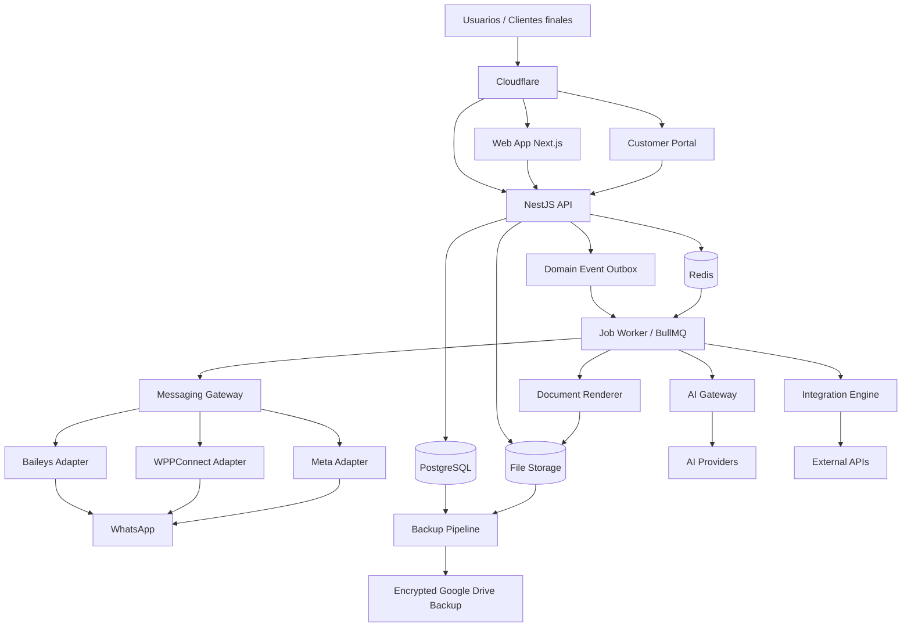

# SYSTEM DESIGN — Plataforma Multitenant de Automatización Empresarial

**Versión:** 1.0-draft-cimentado  
**Fecha:** 2026-08-12  
**Estado:** Arquitectura de referencia para MVP funcional y vendible  
**Documentos superiores:** `PRD.md`, `DATA_MODEL_ERD_MVP_BACKLOG.md`  
**Propósito:** definir cómo se ejecuta físicamente el producto, cómo se comunican sus componentes, dónde vive el estado, cómo se aísla a los tenants, cómo se despliega, opera, recupera y escala sin crear variantes del producto por cliente.

---

## 0. Reglas de lectura y autoridad

1. `PRD.md` define qué producto existe y qué decisiones conceptuales son no negociables.
2. `DATA_MODEL_ERD_MVP_BACKLOG.md` define el modelo conceptual de datos y el orden de construcción.
3. Este documento define topología, límites de servicios, contratos de infraestructura, patrones de resiliencia y operación.
4. Un ADR puede cambiar una decisión técnica concreta si explica impacto y migración.
5. Ningún desarrollador o IA debe cambiar silenciosamente una decisión de este documento.
6. No se permite introducir dependencias estructurales nuevas sin registrar la decisión si afectan deployment, datos, seguridad, tenancy, mensajería, workflows, observabilidad o compatibilidad.

---

# 1. Objetivo arquitectónico

Construir un único producto que soporte:

- SaaS multitenant compartido;
- instancia dedicada administrada por nosotros;
- instancia en infraestructura del cliente;
- uno o múltiples números/cuentas de WhatsApp por tenant;
- múltiples departamentos, sucursales y unidades organizacionales;
- módulos activables por tenant;
- automatización determinista como núcleo;
- IA opcional y desacoplada;
- operación humana desde dashboard y desde el cliente de WhatsApp;
- procesos, agenda, cotización, documentos, portal y acciones requeridas;
- crecimiento gradual sin forks de código.

La arquitectura debe priorizar cuatro cosas en este orden:

1. aislamiento y corrección;
2. continuidad operativa;
3. velocidad de salida comercial;
4. escalabilidad incremental.

No se optimizará prematuramente para miles de tenants antes de validar el producto, pero ninguna decisión del MVP debe impedir crecer sin reescritura completa.

---

# 2. Principios no negociables

## 2.1 Un repositorio y un producto

- Monorepo único.
- Imágenes Docker comunes.
- Mismo esquema de versionado.
- Mismas migraciones.
- Configuración, entitlements y plugins controlados sustituyen forks.
- Prohibido código del tipo `if tenantId === "cliente-x"`.

## 2.2 PostgreSQL es la fuente de verdad

Todo estado crítico debe ser recuperable desde PostgreSQL.

El datastore principal requiere PostgreSQL 18 o superior mientras la convención canónica de IDs utilice `uuidv7()` nativo, según ADR-0012.

Redis/BullMQ se utilizan para:

- colas;
- locks acotados;
- caché;
- timers operativos;
- scheduling;
- rate-limit counters;
- presencia efímera.

No pueden ser la única copia de:

- conversaciones;
- mensajes;
- procesos;
- reglas;
- citas;
- cotizaciones;
- aprobaciones;
- Action Requests;
- entitlements;
- auditoría.

## 2.3 El canal no es el producto

WhatsApp es el primer canal, no la fuente de verdad. Los dominios centrales no dependen de estructuras específicas de Baileys, WPPConnect o Meta.

## 2.4 Reglas primero, IA después

Los cambios de estado, precios, descuentos, permisos, envíos críticos y transiciones se ejecutan por código/reglas deterministas. La IA puede interpretar, clasificar, extraer, sugerir y asistir, pero no sustituye controles deterministas.

## 2.5 Tenant isolation por defecto

Todo acceso tenant-owned debe recibir el tenant desde contexto autenticado, nunca desde confianza en un parámetro enviado por el cliente.

## 2.6 Arquitectura preparada para Temporal sin usarlo en MVP

El dominio habla con una interfaz `WorkflowOrchestrator`. El adapter MVP utiliza BullMQ. Un adapter Temporal puede añadirse posteriormente.

---

# 3. Vista lógica de alto nivel



---

# 4. Topología física inicial del MVP

El MVP se ejecutará en el servidor propio del negocio usando Docker Compose.

```text
Host Linux
├── cloudflared
├── reverse-proxy
├── web
├── api
├── postgres
├── redis
├── worker-jobs
├── worker-whatsapp-1..N
├── document-renderer
├── ai-gateway
├── file-storage-volume
├── backup-runner
└── observability-lite
```

No se requiere Kubernetes en MVP.

## 4.1 Servicios que pueden compartir contenedor inicialmente

Para reducir complejidad durante el primer vertical slice, algunos componentes pueden iniciar juntos si conservan límites de código claros. La separación lógica es obligatoria aunque la separación física pueda llegar después.

Aceptable temporalmente:

- API + event publisher;
- worker de jobs con varios tipos de jobs;
- frontend y portal dentro de la misma app Next.js con boundaries claros.

No recomendable mezclar físicamente:

- PostgreSQL con aplicación;
- Redis con aplicación;
- navegador WPPConnect con API web;
- document renderer pesado con API request-response;
- backup runner con API.

---

# 5. Monorepo de referencia

```text
/
├── apps/
│   ├── web/                 # dashboard, super admin y portal shell
│   ├── api/                 # NestJS API y application services
│   ├── worker-jobs/         # BullMQ consumers
│   ├── worker-whatsapp/     # lifecycle de sesiones/cuentas
│   └── document-renderer/   # HTML/CSS -> PDF
├── services/
│   └── ai-gateway/
├── packages/
│   ├── auth/
│   ├── database/
│   ├── tenancy/
│   ├── rbac/
│   ├── config/
│   ├── events/
│   ├── outbox/
│   ├── workflows/
│   ├── messaging-core/
│   ├── messaging-baileys/
│   ├── messaging-wppconnect/
│   ├── messaging-meta/
│   ├── processes/
│   ├── rules/
│   ├── actions/
│   ├── appointments/
│   ├── quotes/
│   ├── documents/
│   ├── catalog/
│   ├── crm/
│   ├── portal/
│   ├── integrations/
│   ├── ui/
│   ├── themes/
│   └── contracts/
├── infra/
│   ├── docker/
│   ├── cloudflare/
│   ├── backup/
│   └── scripts/
├── .agents/
│   ├── agents.md
│   └── skills/whatsapp-platform-engineering/SKILL.md
├── platform_docs/
│   ├── docs/
│   │   ├── INDEX.md
│   │   └── adr/
│   ├── PRD.md
│   ├── SYSTEM_DESIGN.md
│   ├── DATA_MODEL_ERD_MVP_BACKLOG.md
│   ├── DESIGN.md
│   ├── UI_FLOWS.md
│   ├── STATUS.md
│   ├── CHANGELOG.md
│   ├── SECURITY.md
│   ├── TESTING_STRATEGY.md
│   ├── DEPLOYMENT.md
│   ├── RUNBOOK_BACKUP_RESTORE.md
│   ├── RUNBOOK_OPERATIONS.md
│   └── ROADMAP.md
├── AGENTS.md
└── README.md
```

---

# 6. Bounded contexts y responsabilidades

## 6.1 Platform / Tenancy

Responsable de:

- Tenant;
- entitlements;
- planes/limits;
- deployment mode;
- feature flags globales;
- suspensión/reactivación;
- organization units;
- branding base.

No contiene lógica de WhatsApp, agenda o procesos.

## 6.2 Identity / RBAC

Responsable de:

- usuarios;
- roles;
- permisos;
- sesiones;
- scopes por Organization Unit;
- revocación;
- MFA futuro.

## 6.3 CRM Lite

Responsable de:

- contactos;
- organizaciones cliente;
- puntos de contacto;
- etiquetas;
- notas;
- relaciones;
- vista 360.

## 6.4 Channel / Messaging

Responsable de:

- cuentas de canal;
- sesiones de provider;
- conversaciones;
- mensajes;
- attachments;
- delivery state;
- reconciliación de echoes;
- origen/actor;
- human takeover.

## 6.5 Process Engine

Responsable de:

- definiciones/versiones;
- fields;
- statuses;
- transitions;
- instances;
- invariantes;
- relación con timeline y Action Requests.

## 6.6 Rules Engine

Responsable de:

- triggers;
- condiciones;
- acciones;
- validación;
- loop protection;
- execution log.

El Rules Engine no debe llamar directamente a SDKs externos. Dispara application services o jobs.

## 6.7 Workflow Orchestrator

Responsable de:

- scheduling;
- retries;
- delays;
- cancelación;
- señales futuras;
- idempotencia;
- reconciliación.

MVP: BullMQ adapter. Futuro: Temporal adapter.

## 6.8 Appointments

Responsable de disponibilidad, recursos, servicios, reservas, cancelaciones y reprogramación.

## 6.9 Quote Engine

Responsable de cálculo determinista, políticas, aprobación, versionado y estado de cotización.

## 6.10 Document Engine

Responsable de template versionado, render reproducible, branding y almacenamiento del documento generado.

## 6.11 Customer Portal

Responsable de grants, acceso seguro y lectura/acción sobre información explícitamente visible al cliente.

## 6.12 AI Gateway

Responsable de:

- providers;
- credenciales;
- task routing;
- fallback;
- clasificación de datos;
- políticas por tenant;
- métricas/costo;
- redacción previa cuando aplique.

---

# 7. Multi-tenancy físico y lógico

## 7.1 MVP compartido

PostgreSQL compartido con schema común y `tenant_id` obligatorio para tablas tenant-owned.

Reglas:

- `tenant_id` se deriva de sesión/token;
- repositories tenant-aware obligatorios;
- no se exponen métodos genéricos que acepten `tenant_id` arbitrario desde controllers;
- constraints unique que pertenezcan a un tenant deben incluir `tenant_id`;
- tests de aislamiento P0;
- logs llevan `tenant_id`, pero nunca secretos;
- uploads incluyen path/ownership tenant-scoped.

## 7.2 Defensa adicional futura

Evaluar PostgreSQL Row Level Security tras estabilizar repositories. RLS se considera defensa en profundidad, no sustituto de autorización de aplicación.

## 7.3 Dedicated y customer-hosted

La aplicación conserva el mismo schema y comportamiento. Cambia deployment/configuración, no el código.

Una instancia dedicada puede alojar un solo tenant o un grupo contractual explícito, pero no requiere fork.

---

# 8. Entitlements y módulos

El Super Admin controla qué módulos y capacidades existen para un tenant.

Tres niveles de validación:

1. **UI:** no mostrar o marcar bloqueado.
2. **API:** rechazar uso no autorizado.
3. **Workers:** revalidar antes de acciones que generen costo, mensajes o side effects.

Nunca confiar sólo en ocultar UI.

Ejemplos:

```text
module.messaging.basic
module.automation.basic
module.automation.advanced
module.crm_lite
module.processes
module.action_requests
module.appointments
module.catalog
module.quotes
module.documents
module.customer_portal
module.ai
module.integrations
module.white_label
limit.channel_accounts
limit.users
limit.organization_units
limit.storage_bytes
limit.monthly_ai_budget
```

Desactivar un módulo no borra datos. Se preservan para reactivación o export/offboarding.

Baseline E03-S04:

- los catálogos TypeScript cerrados contienen exactamente 14 módulos y cinco limits y son la única fuente usada por provisioning, detalle, administración y enforcement;
- un entitlement es efectivo sólo si la row existe, está enabled, `startsAt <= now` y `endsAt > now`;
- el facade tenant expone resolución read-only; sólo el boundary Platform puede ejecutar upsert `manual_override`;
- API revalida PostgreSQL en cada request mediante `TenantEntitlementGuard`; no hay snapshot en sesión/JWT/contexto ni cache Redis;
- `assertTenantModuleEntitled(...)` es el contrato reusable no-Nest para que futuros workers revaliden antes de costo o side effects;
- disable preserva row, config y datos; re-enable reutiliza esa configuración;
- config es un objeto JSON opaco, no secreto, reemplazado por completo y no interpretado por el guard genérico;
- cada mutation Platform persiste entitlement, Audit y Outbox en una sola transacción.

Baseline E03-S05:

- `active` es el único estado operacional Tenant; `suspended`, `provisioning`, `offboarding` y `archived` fallan cerrados para actividad Tenant;
- sólo Platform Control puede ejecutar `active ↔ suspended`; la mutation es idempotente, preserva `suspendedAt` en retries y no realiza transiciones genéricas;
- suspensión bloquea uso de sesiones Tenant existentes por revalidación PostgreSQL, pero no las revoca ni altera identidad, roles, módulos o datos;
- Platform queries y administración de entitlements no dependen de que el Tenant esté active;
- status, Audit y Outbox se confirman en una transacción. Jobs/workers futuros revalidarán estado operacional y entitlement justo antes de side effects, sin confiar en el estado que tenían al encolarse.

---

# 9. Organización jerárquica

`OrganizationUnit` representa sucursal, departamento, área o combinación jerárquica.

Ejemplo:

```text
Tenant
├── León
│   ├── Ventas
│   ├── Atención
│   └── Cobranza
└── Querétaro
    ├── Ventas
    └── Servicio
```

Recursos asignables a unidades:

- users;
- roles/scopes;
- channel accounts;
- appointments/resources;
- processes;
- responsables;
- business hours;
- dashboards filtrados.

Los contactos son globales dentro del tenant salvo requisito explícito futuro.

---

# 10. Flujo de request HTTP

```text
Client
 -> Cloudflare
 -> reverse proxy
 -> API
 -> correlation-id
 -> authentication
 -> tenant resolution
 -> entitlement check
 -> RBAC/scope check
 -> validation
 -> application service
 -> transaction
 -> outbox event
 -> response
```

Cada request debe generar o propagar:

- `request_id`;
- `trace_id` cuando exista;
- `tenant_id`;
- `actor_id` cuando exista.

---

# 11. Patrón Application Service

Controllers no contienen reglas de negocio.

```text
Controller
  -> DTO validation
  -> ApplicationService
       -> authorization policy
       -> domain operation
       -> repository
       -> outbox
```

Los providers externos quedan detrás de ports/adapters.

---

# 12. Transacciones y Outbox

Para evitar “DB actualizada pero mensaje/evento perdido”:

1. modificar estado de dominio en una transacción PostgreSQL;
2. insertar `domain_event_outbox` en la misma transacción;
3. publisher procesa eventos pendientes;
4. marca evento publicado de forma idempotente;
5. consumer ejecuta side effect con idempotency key.

Ejemplo:

```text
Quote approved + outbox(quote.approved)
COMMIT
        ↓
worker
        ↓
generate document
        ↓
send WhatsApp
```

No enviar mensajes externos dentro de la transacción de negocio.

---

# 13. Idempotencia

Obligatoria para:

- inbound message processing;
- outbound message sends;
- quote send;
- document generation;
- appointment reminder;
- Action Request completion;
- webhook processing;
- domain event consumers;
- scheduled jobs.

Una idempotency key debe ser estable y tenant-scoped.

Ejemplo:

```text
msg-in:{tenant}:{provider}:{externalMessageId}
quote-send:{tenant}:{quoteVersionId}:{channelAccountId}
appointment-reminder:{tenant}:{appointmentId}:{offset}
```

---

# 14. Messaging Gateway

## 14.1 Contrato

El dominio utiliza un contrato conceptual:

```ts
interface MessagingProvider {
  connect(account): Promise<ConnectionResult>
  disconnect(account): Promise<void>
  sendMessage(command): Promise<ProviderMessageResult>
  sendMedia(command): Promise<ProviderMessageResult>
  getHealth(account): Promise<ProviderHealth>
  normalizeInbound(event): NormalizedMessageEvent[]
}
```

No exponer tipos de Baileys/WPPConnect/Meta fuera del adapter.

## 14.2 Normalized Message

Debe capturar como mínimo:

- tenant;
- channel account;
- provider;
- external message id;
- conversation external id;
- contact point;
- direction;
- origin;
- actor classification;
- timestamp provider;
- content type;
- text/caption;
- attachment refs;
- raw metadata limitada cuando sea necesaria para diagnóstico.

## 14.3 Múltiples cuentas

Cada `ChannelAccount` es independiente y cuenta contra entitlements.

Una cuenta puede pertenecer a una Organization Unit.

## 14.4 Lifecycle

Estados mínimos:

```text
not_configured
pairing
connected
degraded
disconnected
requires_reauth
disabled
```

El worker debe exponer health y último error normalizado.

## 14.5 Sesiones

Las credenciales de sesión deben guardarse cifradas. No usar almacenamiento de archivos multi-session como fuente de verdad de producción cuando el provider permita persistencia estructurada.

## 14.6 Baileys

Provider inicial y prioritario para QR, demo y primeros clientes.

## 14.7 WPPConnect

Segundo adapter, no fallback transparente de sesión. Requiere su propia vinculación/sesión.

## 14.8 Meta

Provider oficial futuro para clientes que requieran ese camino. Debe usar el mismo contrato normalizado.

---

# 15. Sincronización humano, bot y dispositivo

El mensaje persistido debe distinguir `origin` y `actor`.

Origen inicial:

```text
customer
human_app
human_external_device
bot_rule
bot_ai
automation
integration
system
```

Reglas:

- si nuestra plataforma crea el outbound, conserva el `message_id` interno y provider id;
- si llega un evento `fromMe`/equivalente y no corresponde a un outbound conocido, se clasifica como `human_external_device`;
- dashboard outbound debe guardar `actor_user_id`;
- mensajes automáticos guardan `rule_execution_id` o `ai_execution_id` cuando corresponda;
- reconciliación debe evitar duplicados cuando el provider hace echo.

## 15.1 Automation modes

```text
AUTO      sistema actúa dentro de reglas habilitadas
ASSISTED  sistema prepara/sugiere y espera aprobación
HUMAN     automatización conversacional pausada
MONITOR   sistema observa/clasifica, no responde
```

## 15.2 Human takeover

Política configurable por tenant:

- pausar al detectar outbound humano externo;
- duración fija;
- hasta cierre;
- no pausar.

El estado final se persiste en PostgreSQL.

---

# 16. Rules Engine

## 16.1 Forma de una regla

```text
Trigger
Conditions[]
Actions[]
Policy
Version
Status
```

## 16.2 Triggers MVP

- message.received
- message.sent
- conversation.mode_changed
- process.created
- process.status_changed
- action_request.created
- action_request.completed
- appointment.created
- appointment.cancelled
- appointment.reminder_due
- quote.created
- quote.approved
- quote.sent
- scheduled.time_reached

## 16.3 Condiciones MVP

- igualdad/desigualdad;
- contains;
- regex;
- presence/absence;
- estado actual;
- channel account;
- organization unit;
- tag;
- horario;
- actor/origin;
- numeric comparisons;
- entitlement;
- custom field.

## 16.4 Acciones MVP

- send_message;
- set_conversation_mode;
- assign_conversation;
- add_tag;
- update_process_status;
- create_action_request;
- create_timeline_event;
- schedule_job;
- notify_user/role;
- create_quote draft;
- request_human_approval;

## 16.5 Seguridad

- schema JSON validado;
- allowlist de acciones;
- límites de profundidad;
- loop guard;
- execution budget;
- rate limits;
- no eval arbitrario;
- no código JS aportado por tenant en MVP.

---

# 17. Workflow Orchestrator

Contrato conceptual:

```ts
interface WorkflowOrchestrator {
  enqueue(command): Promise<JobRef>
  schedule(command, runAt): Promise<JobRef>
  cancel(jobRef): Promise<void>
  retry(jobRef): Promise<void>
  getStatus(jobRef): Promise<JobStatus>
}
```

MVP adapter: BullMQ.

El dominio no importa BullMQ directamente.

## 17.1 Reconciliación

Jobs críticos deben tener una referencia PostgreSQL y un proceso periódico debe detectar:

- jobs DB pendientes sin job Redis;
- job fallido agotado;
- job ejecutado sin actualización DB;
- scheduled jobs vencidos.

## 17.2 Temporal readiness

Cuando existan workflows de semanas/meses, señales complejas o alto costo de compensación, crear ADR para habilitar Temporal. La interfaz y eventos del dominio deben minimizar la migración.

---

# 18. Process Engine

## 18.1 Definición vs instancia

- Definition es configurable y versionada.
- Instance conserva `definition_version`.
- Cambiar una definition publicada crea nueva versión.
- Una instancia no cambia semántica histórica silenciosamente.

## 18.2 Transiciones

Toda transición pasa por un único application service:

```text
load instance
validate tenant
validate current status
validate transition
validate actor permission
validate required fields/action requests
apply state
append timeline event
insert outbox event
commit
```

Nunca permitir actualizar `status_id` directamente desde controller/UI.

## 18.3 Public visibility

Estado y timeline distinguen:

```text
internal
customer
both
```

No inferir visibilidad. Debe ser explícita.

---

# 19. Action Request

Primitiva genérica para solicitar una acción a cliente o empleado.

Tipos iniciales:

- upload_document;
- approve;
- reject_or_approve;
- choose_option;
- provide_information;
- confirm;
- sign_future;
- payment_future.

La resolución desde WhatsApp, portal o dashboard debe terminar en el mismo application service idempotente.

---

# 20. Agenda

Disponibilidad se calcula desde:

- service duration;
- resource assignment;
- business hours;
- availability rules;
- exceptions;
- existing appointments;
- buffers;
- timezone.

La operación `bookAppointment` debe proteger contra double-booking con constraint/locking transaccional adecuado.

Recordatorios se programan mediante `WorkflowOrchestrator`, no con timers en memoria.

---

# 21. Quote Engine

## 21.1 Regla crítica

IA puede interpretar la solicitud, pero no decide de forma libre:

- precio;
- impuesto;
- descuento permitido;
- margen mínimo;
- aprobación;
- inventario;
- condiciones comerciales.

## 21.2 Calculation service

Debe ser determinista y testeable con snapshots/casos.

## 21.3 Autonomy policy

Niveles:

```text
0 manual
1 assisted
2 autonomous_with_limits
3 autonomous
```

Políticas pueden evaluar:

- total;
- descuento;
- margen;
- cliente nuevo;
- stock;
- producto especial;
- crédito/bloqueo futuro;
- Organization Unit;
- rol aprobador.

## 21.4 Versioning

Toda cotización enviada debe guardar snapshot/version inmutable de:

- items;
- prices;
- tax;
- totals;
- terms;
- template version;
- branding snapshot relevante.

---

# 22. Document Renderer

Render recomendado:

```text
Template versioned HTML/CSS
+ structured document data
+ branding snapshot
          ↓
headless renderer
          ↓
PDF
          ↓
storage
```

Requisitos:

- reproducible;
- deterministic where possible;
- no cargar recursos remotos arbitrarios al renderizar;
- fuentes autorizadas incluidas por el producto;
- logos validados;
- límites de tamaño;
- 10 temas iniciales profesionales;
- template version persistida.

---

# 23. Customer Portal

Portal y WhatsApp consumen los mismos application services/read models.

No duplicar lógica de negocio.

## 23.1 Acceso

MVP puede usar grants firmados con:

- token aleatorio de alta entropía;
- expiración;
- scope;
- revocación;
- audit;
- rate limit.

Cuenta persistente de portal puede agregarse después.

## 23.2 Seguridad

Portal sólo devuelve:

- estados públicos;
- timeline visible;
- documentos permitidos;
- Action Requests del sujeto;
- información expresamente grant-scoped.

Nunca reutilizar DTOs administrativos sin projection específica.

---

# 24. AI Gateway

## 24.1 Contrato por tarea

El dominio solicita tareas, no modelos concretos.

Ejemplos:

```text
intent.classify
entities.extract
faq.answer
catalog.match
conversation.summarize
reply.suggest
```

## 24.2 Routing

Criterios:

- task;
- data classification;
- tenant policy;
- model/provider health;
- latency;
- budget;
- capability;
- fallback priority.

## 24.3 Multi-key

Se permiten múltiples credenciales legítimas de un proveedor para organizaciones/proyectos autorizados. No diseñar evasión de límites contractuales.

## 24.4 Sensitive data

Cada provider/model route declara clases de datos permitidas. La política del tenant puede ser más restrictiva.

## 24.5 Failure

Una falla de IA nunca debe impedir acciones deterministas esenciales si existe camino sin IA.

---

# 25. Files y storage

MVP: almacenamiento local persistente fuera del filesystem efímero del contenedor.

Layout conceptual:

```text
/storage/
  tenants/{tenant_id}/
    attachments/
    documents/
    logos/
    imports/
```

Reglas:

- DB guarda metadata/ownership/hash;
- nombres físicos no dependen del nombre original;
- antivirus/malware scanning queda roadmap, pero debe existir hook;
- MIME detectado, no confiar sólo en extensión;
- tamaño máximo por entitlement;
- downloads autorizados por API o signed route controlada;
- no servir `/storage` públicamente sin autorización.

---

# 26. Backup y disaster recovery

## 26.1 Estrategia MVP

Servidor propio = producción primaria. Google Drive = backup cifrado asíncrono.

Retención remota: exactamente dos respaldos completos confirmados:

```text
current
previous
```

## 26.2 Secuencia segura

1. verificar espacio local;
2. crear `pg_dump` consistente;
3. recopilar storage/config incluida;
4. generar manifest;
5. comprimir;
6. cifrar;
7. calcular checksum;
8. subir a Drive;
9. verificar remote size/checksum cuando sea posible;
10. registrar backup como verified;
11. rotar current -> previous;
12. eliminar tercero sólo después de confirmar nuevo;
13. limpiar temporal local según política.

## 26.3 Contenido

- PostgreSQL dump;
- tenant file storage requerido;
- configuración no secreta;
- metadata necesaria para reconstrucción;
- manifest con versión de aplicación/schema;
- hashes.

Secrets deben contar con procedimiento de recuperación separado y cifrado.

## 26.4 Operación

- backup asíncrono;
- no bloquear API;
- alerta si último backup verificado supera umbral;
- restore drill obligatorio antes de primer cliente pagado y periódicamente.

---

# 27. Seguridad de secretos

Nunca en Git:

- provider credentials;
- WhatsApp session material;
- DB passwords;
- encryption keys;
- Cloudflare tokens;
- Google credentials;
- JWT secrets.

MVP:

- variables/secret files fuera de repo con permisos de sistema;
- cifrado application-level para secretos tenant-owned en DB;
- key de cifrado fuera de DB;
- redacción en logs;
- rotación documentada.

Futuro: secret manager si escala/justifica.

---

# 28. Autenticación y sesiones

MVP:

- email + contraseña fuerte para dashboard;
- hash con algoritmo moderno configurable;
- cookies HttpOnly/Secure/SameSite adecuadas o estrategia equivalente;
- CSRF protection si aplica al patrón elegido;
- sesión revocable;
- tenant/user status revalidado;
- rate limiting de login;
- password reset con token de un solo uso;
- audit de acciones administrativas sensibles.

Super Admin debe tener política más estricta y ruta/host diferenciable cuando sea viable.

E02-S01 implementa Platform Admin como identidad de control plane separada, sin tenant. Usa Argon2id para contraseñas y sesiones opacas server-side: el navegador conserva el token sólo en cookie HttpOnly/SameSite Strict y PostgreSQL conserva exclusivamente su SHA-256. La sesión revalida estado activo, revocación, expiración absoluta de 8 horas e inactividad de 30 minutos. Las rutas baseline son `POST /platform/auth/login`, `GET /platform/auth/me` y `POST /platform/auth/logout`; las mutaciones exigen el origen web configurado.

E02-S02 mantiene `User` físicamente separado y tenant-owned. El login pre-session resuelve workspace exclusivamente por slug de ruta; tras autenticar, `UserSession.tenant_id` es la autoridad. Sesiones tenant opacas usan cookie distinta, TTL absoluto de 12 horas e idle de 2 horas. Password reset usa token opaco single-use de 15 minutos, delivery port posterior al commit y URL construida desde `TENANT_WEB_ORIGIN`; E02-S03 añadirá el middleware general de `TenantContext`.

---

# 29. RBAC y scopes

Autorización = entitlement + permission + scope + resource policy.

Ejemplo:

```text
¿Puede aprobar quote?
1. tenant activo
2. module.quotes enabled
3. quote.approve permission
4. quote pertenece al tenant
5. Organization Unit dentro de scope
6. policy amount/role satisfecho
```

No codificar sólo `role === admin`.

Baseline E02-S05/E03-S04:

- `PermissionKey` deriva del catálogo global versionado en `packages/rbac`; roles agrupan grants explícitos y sus nombres no son autoridad.
- Los roles asignables son tenant-owned. Roles template con `tenant_id = NULL` no se asignan directamente a `User`.
- El flujo protegido es `TenantUserSessionGuard` → `TenantContextGuard` → `TenantPermissionGuard` cuando aplica → `TenantEntitlementGuard` cuando existe metadata; ambos controles consumen el contexto autenticado y nunca lo reconstruyen desde request.
- El resolver tenant-wide ignora assignments con Organization Unit y grants con constraints; ambas variantes fallan cerradas hasta existir resolución resource-aware.
- Múltiples permisos requeridos usan ALL y múltiples roles válidos producen una unión allow-set sin deny ni jerarquía.
- Los permisos se consultan en PostgreSQL por request y no se embeben en sesión ni se cachean en Redis.
- Permission y entitlement son controles independientes con semántica ALL: uno nunca concede el otro. Los entitlements también se consultan en PostgreSQL por request y una revocación afecta la siguiente request de la misma sesión.

Decisión completa en ADR-0017.

---

# 30. Observabilidad

MVP mínimo:

## Logs estructurados

Campos:

- timestamp;
- level;
- service;
- environment;
- request_id/trace_id;
- tenant_id;
- actor_id cuando aplique;
- channel_account_id cuando aplique;
- event/job id;
- normalized error code.

Nunca loggear bodies completos con PII por defecto.

## Métricas mínimas

- API error rate;
- latency;
- active channel accounts;
- disconnected/requires_reauth;
- inbound/outbound counts;
- queue depth;
- job failures;
- outbox lag;
- DB health/connections;
- disk usage;
- backup age/status;
- AI calls/errors/cost estimate;
- document render failures.

## Health endpoints

- liveness: proceso vivo;
- readiness: dependencias mínimas disponibles;
- deep health restringido: DB, Redis, worker, storage, providers.

---

# 31. Error handling

Definir errores por dominio:

```text
TENANT_SUSPENDED
ENTITLEMENT_REQUIRED
CHANNEL_LIMIT_REACHED
CHANNEL_REQUIRES_REAUTH
PERMISSION_DENIED
PROCESS_TRANSITION_INVALID
ACTION_REQUEST_ALREADY_COMPLETED
APPOINTMENT_SLOT_UNAVAILABLE
QUOTE_APPROVAL_REQUIRED
AI_PROVIDER_UNAVAILABLE
```

Controllers transforman a respuestas públicas seguras.

Detalles internos quedan en logs correlacionados.

---

# 32. Retry policy

Reintentar sólo errores razonablemente transitorios.

Ejemplos:

- provider 429/5xx;
- network timeout;
- temporary external API failure.

No reintentar indefinidamente:

- permission denied;
- invalid payload;
- entitlement missing;
- revoked grant;
- invalid state transition.

Usar exponential backoff + jitter, límites y dead-letter/failed state observable.

---

# 33. Webhooks e integraciones

Inbound:

- autenticación/firma cuando provider lo permita;
- idempotencia por event id;
- guardar metadata esencial;
- responder rápido;
- procesar side effects asíncronos.

Outbound:

- delivery record;
- retries;
- firma HMAC futura;
- timeout;
- disable automático/manual tras fallos persistentes configurable.

---

# 34. Networking

## 34.1 Exposición pública

Sólo tráfico web necesario a través de Cloudflare Tunnel.

No exponer directamente:

- PostgreSQL;
- Redis;
- internal worker APIs;
- storage volumes;
- admin metrics sin protección.

## 34.2 Docker networks

Separar al menos:

- edge/app network;
- internal data network.

Postgres/Redis únicamente en red interna.

---

# 35. Cloudflare

MVP usa Cloudflare Tunnel persistente administrado, no túneles temporales de prueba.

Objetivos:

- evitar puertos inbound abiertos;
- TLS en edge;
- hostname controlado;
- WAF/rate limiting según plan disponible;
- posible Access adicional para Super Admin/operación.

La aplicación no debe depender de una API propietaria de Cloudflare para su lógica de negocio.

---

# 36. Deployment modes

## 36.1 Shared SaaS

- una instalación;
- múltiples tenants;
- entitlements individuales;
- channel workers multiplexan o se shardean por cuenta.

## 36.2 Dedicated

- mismas imágenes;
- config de deployment;
- posiblemente un tenant;
- recursos dedicados;
- release channel configurable;
- control de versión central documentado.

## 36.3 Customer-hosted

Se entrega stack Docker/Compose/versionado con configuración, documentación y procedimiento de actualización.

Reglas:

- no entregar branch especial;
- no saltar migraciones;
- plugins específicos sólo mediante contratos definidos;
- secrets propiedad del deployment;
- telemetría sólo si contrato/política lo permite.

---

# 37. Release y migraciones

SemVer.

Requisito de datastore: PostgreSQL >= 18. Las migrations pueden depender de funciones core introducidas en esa major, incluido `uuidv7()`.

Canales:

```text
stable
candidate
beta
```

Toda release con schema change debe incluir:

- migration;
- backward/forward compatibility analysis;
- rollback plan cuando sea viable;
- backup requirement;
- CHANGELOG;
- STATUS update;
- ADR si cambia arquitectura.

No editar migraciones ya aplicadas en producción.

---

# 38. CI/CD mínimo

Pipeline obligatorio antes de release:

1. install reproducible;
2. lint;
3. typecheck;
4. unit tests;
5. integration tests;
6. tenant isolation tests;
7. build;
8. migration validation;
9. dependency/security scan;
10. container build;
11. smoke tests.

Deploy MVP puede ser manual asistido por script hasta tener confianza, pero debe ser repetible.

---

# 39. Testing boundaries

## Unit

- calculation services;
- rule evaluators;
- transition validation;
- entitlement logic;
- permission policies;
- AI route selection.

## Integration

- repositories + PostgreSQL;
- outbox;
- BullMQ adapter;
- file metadata;
- messaging normalization fixtures.

## Contract

Cada MessagingProvider debe aprobar una suite común.

## E2E

Vertical slice vendible:

```text
tenant -> channel connect -> inbound -> contact -> conversation
-> rule -> outbound -> inbox -> human reply -> synchronization
```

Antes de primer cliente pagado incluir:

- backup restore;
- tenant escape attempts;
- revoked/suspended tenant;
- channel limit;
- duplicate provider event;
- restart recovery.

---

# 40. Vertical slice comercial P0

El primer producto demostrable NO espera agenda/cotizaciones/portal completos.

Debe permitir:

1. Super Admin login.
2. Crear tenant.
3. Activar Messaging Basic + Automation Basic.
4. Tenant Admin login.
5. Crear Organization Unit opcional.
6. Conectar una cuenta WhatsApp por QR con Baileys.
7. Recibir mensaje real.
8. Crear/resolver contacto.
9. Crear conversación.
10. Mostrarla en Inbox.
11. Ejecutar regla básica.
12. Responder automáticamente.
13. Responder desde dashboard.
14. Detectar respuesta humana externa desde WhatsApp.
15. Distinguir origen.
16. Cambiar AUTO/HUMAN.
17. Auditar eventos relevantes.
18. Sobrevivir reinicio normal sin perder estado de negocio.

Este vertical slice debe construirse antes de expandir profundidad en módulos P1.

---

# 41. Definition of Sellable MVP

Un MVP es vendible cuando puede operar un caso básico real con límites claros y soporte humano.

Debe cumplir:

- tenant isolation tests pasan;
- backup + restore probado;
- conexión WhatsApp estable para la demo/piloto;
- reconexión/reauth observable;
- inbox usable;
- respuesta automática configurable básica;
- respuesta humana desde app;
- sincronización con outbound humano externo;
- roles base;
- entitlements aplicados;
- logs/health suficientes;
- deployment reproducible;
- no existen secrets en repo;
- onboarding documentado;
- limitaciones conocidas registradas en `STATUS.md`.

No requiere todavía:

- Meta adapter;
- WPPConnect;
- Temporal runtime;
- builder visual avanzado;
- IA obligatoria;
- agenda completa;
- cotizaciones completas;
- portal completo.

---

# 42. Escalamiento incremental

## Etapa 1 — servidor único

Docker Compose y PostgreSQL/Redis locales.

## Etapa 2 — separar cargas pesadas

- document renderer;
- WPPConnect browser workers;
- AI gateway;
- dedicated WhatsApp worker groups.

## Etapa 3 — DB/Redis administrados o hosts dedicados

Sólo cuando ingresos, carga o disponibilidad lo justifiquen.

## Etapa 4 — horizontalización

- stateless API replicas;
- sticky/lifecycle strategy para workers de canal;
- queue workers horizontales;
- storage object-compatible si se necesita;
- Temporal si workflows durables lo justifican.

No asumir una etapa futura concreta antes de medir.

---

# 43. Capacidad y resource governance

Todo tenant debe tener límites medibles:

- channel accounts;
- users;
- org units;
- storage;
- automation executions;
- AI spend/budget;
- future message volume limits.

El sistema debe poder negar creación antes de superar el límite, no descubrirlo después.

---

# 44. Degradación controlada

Si IA cae:

- reglas deterministas siguen funcionando;
- inbox sigue disponible;
- humano puede responder.

Si Redis cae:

- API puede pasar a degraded;
- no perder estado de negocio;
- jobs se recuperan por reconciliación.

Si provider WhatsApp cae:

- channel health = degraded/disconnected;
- inbox histórico disponible;
- no fingir envío exitoso;
- jobs esperan/fallan según policy.

Si document renderer cae:

- quote puede quedar approved/pending_document;
- job reintenta;
- no duplicar quote.

---

# 45. Auditoría

Eventos auditables mínimos:

- login/admin sensitive action;
- tenant create/suspend;
- entitlement changes;
- user/role changes;
- channel connect/disconnect/re-auth;
- conversation mode change;
- manual outbound message actor;
- process transition;
- Action Request complete;
- quote approval/send;
- document visibility change;
- AI policy/credential changes;
- backup operations;
- secret rotation metadata.

Audit log debe ser append-oriented y protegido de edición ordinaria.

---

# 46. Datos sensibles y logging

Principio: registrar suficiente para diagnosticar, no convertir logs en segunda base de datos de PII.

No loggear por defecto:

- full message text;
- full documents;
- access tokens;
- cookies;
- API keys;
- WhatsApp auth material;
- passwords;
- portal tokens.

Permitir debug temporal explícito con redacción y caducidad, nunca activado globalmente en producción sin causa.

---

# 47. Plugins/extensiones futuras

Antes de permitir plugins de cliente, definir contratos estables.

Un plugin no puede:

- acceder a DB de otro tenant;
- saltarse application services;
- escribir tablas core arbitrariamente;
- importar SDKs internos no públicos;
- asumir deployment mode.

Preferir:

- events;
- webhooks;
- connector interfaces;
- approved extension points.

Código específico de cliente es último recurso y debe quedar aislado en un paquete/plugin, nunca en core.

---

# 48. Decisiones deliberadamente pospuestas

No resolver en MVP salvo necesidad comercial real:

- Kubernetes;
- microservicios completos;
- Temporal runtime;
- Meta Embedded Signup;
- WPPConnect en producción;
- omnicanal más allá de WhatsApp;
- SSO enterprise;
- billing automático;
- marketplace de plugins;
- object storage externo;
- full-text/vector infrastructure dedicada;
- event streaming Kafka/NATS.

Posponer no significa impedir; los boundaries deben permitir incorporación posterior.

---

# 49. Checklist de una nueva feature

Antes de implementar:

1. ¿Está permitida por PRD?
2. ¿Es core reusable o requisito de un cliente?
3. ¿Puede resolverse por configuración/template?
4. ¿Qué entitlement la controla?
5. ¿Qué permiso requiere?
6. ¿Qué Organization Unit scope aplica?
7. ¿Qué datos persiste?
8. ¿Qué eventos genera?
9. ¿Qué side effects requieren outbox/job?
10. ¿Qué idempotencia necesita?
11. ¿Qué audit necesita?
12. ¿Qué comportamiento tiene si dependencia externa falla?
13. ¿Qué tests de tenant isolation necesita?
14. ¿Afecta backup/restore?
15. ¿Requiere ADR?

---

# 50. Reglas para agentes de IA/desarrolladores

Este System Design debe utilizarse junto con `.agents/skills/whatsapp-platform-engineering/SKILL.md`.

Está prohibido:

- cambiar stack base sin ADR;
- crear un fork para un tenant;
- usar Redis como única fuente de estado crítico;
- llamar SDK de provider desde dominio;
- saltar entitlement/RBAC en workers;
- poner lógica de precios en LLM;
- ejecutar código arbitrario de reglas;
- enviar side effects externos antes de commit de dominio;
- introducir secretos en repo;
- asumir que `fromMe` identifica qué humano exacto escribió fuera de la app;
- afirmar que Baileys/WPPConnect son interoperables a nivel sesión;
- implementar Temporal directo en dominio.

---

# 51. Próximos documentos que dependen de este diseño

- `UI_FLOWS.md`: comportamiento pantalla por pantalla.
- `DESIGN.md`: sistema visual y componentes.
- `SECURITY.md`: threat model detallado.
- `TESTING_STRATEGY.md`: matriz de pruebas ampliada.
- `DEPLOYMENT.md`: comandos, environments y procedimiento de release.
- `RUNBOOK_BACKUP_RESTORE.md`: restauración paso a paso.
- `RUNBOOK_OPERATIONS.md`: incidentes y operación diaria.

---

# 52. Criterio de estabilidad documental

Este documento se considera cimentado cuando:

- ninguna sección importante contradice el PRD;
- el vertical slice se puede implementar sin decidir nuevamente topología base;
- cada side effect tiene ownership claro;
- estado crítico tiene fuente de verdad clara;
- deployment shared/dedicated/customer-hosted usa mismo producto;
- una IA nueva puede identificar dónde implementar una función y qué límites no romper.

Cualquier cambio posterior debe actualizar la fecha/versión, `CHANGELOG.md` y ADR cuando corresponda.
