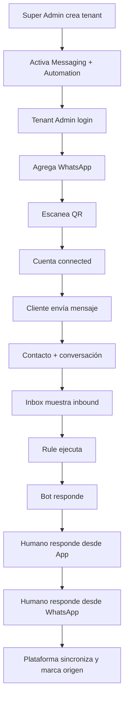

# UI_FLOWS.md — Arquitectura de información y flujos de interfaz

**Versión:** 1.0-draft  
**Fecha:** 2026-08-12  
**Fuentes superiores:** `PRD.md`, `SYSTEM_DESIGN.md`, `DATA_MODEL_ERD_MVP_BACKLOG.md`  
**Propósito:** especificar qué pantallas existen, quién puede acceder, qué acciones permiten, cómo se comportan los módulos/entitlements y qué estados debe representar la UI. Este documento debe alimentar `DESIGN.md`, Open Design y la implementación frontend.

---

# 0. Regla de uso

`UI_FLOWS.md` define **comportamiento e información**, no estilos visuales.

Si Open Design propone una pantalla visualmente atractiva pero contradice este documento, prevalece este documento.

La UI nunca debe inventar una capacidad que API/dominio no soporten.

---

# 1. Actores

## 1.1 Platform Super Admin

Operador nuestro con capacidad para:

- crear/suspender/reactivar tenants;
- configurar módulos/entitlements/límites;
- ver estado de deployments y canales;
- consultar salud/backup/errores;
- administrar parámetros globales permitidos;
- iniciar acciones de soporte controladas.

No debe acceder rutinariamente al contenido sensible de conversaciones/documentos de tenants. Cualquier soporte elevado futuro debe ser auditable y minimizado.

## 1.2 Tenant Owner

Máxima autoridad dentro del tenant.

## 1.3 Tenant Administrator

Administra configuración, usuarios, unidades, canales y módulos habilitados según permisos.

## 1.4 Supervisor

Supervisa conversaciones/procesos/equipo, puede reasignar/aprobar según permisos.

## 1.5 Agent / Operator

Atiende inbox, contactos y procesos autorizados.

## 1.6 Viewer

Lectura limitada.

## 1.7 End Customer / Contact

Usuario externo que interactúa por WhatsApp/portal/formularios.

---

# 2. Principios de navegación

La plataforma tiene dos superficies administrativas separadas conceptualmente:

1. **Platform Control / Super Admin**.
2. **Tenant Workspace**.

El Customer Portal es una tercera superficie externa.

No mezclar navegación del Super Admin con la del tenant.

---

# 3. Module gating

Cada entrada de navegación se deriva de:

```text
entitlement enabled
+ user permission
+ scope
```

Ejemplo:

- tenant sin `module.quotes`: no muestra Quotations en navegación;
- usuario sin `quote.read`: no ve el módulo aunque tenant lo tenga;
- usuario con scope León sólo ve datos de unidades autorizadas cuando la entidad es scoped.

Si el tenant intenta acceder manualmente a una URL de módulo no contratado:

- mostrar página clara de capacidad no disponible o redirigir;
- nunca renderizar datos parciales;
- API debe negar también.

---

# 4. App Shell — Tenant

## 4.1 Desktop

Estructura:

```text
Sidebar
Topbar
Content
Context actions
Notifications/user menu
```

Sidebar potencial:

- Inicio
- Inbox
- Contactos
- Procesos
- Acciones requeridas
- Agenda
- Catálogo
- Cotizaciones
- Documentos
- Portal
- Automatizaciones
- Canales
- Integraciones
- Reportes
- Usuarios y organización
- Configuración

Sólo se muestran entradas disponibles.

## 4.2 Mobile/tablet

Sidebar colapsable/drawer. Inbox debe ser usable desde móvil, aunque la experiencia primaria administrativa sea desktop.

---

# 5. Login Tenant

## Información

- logo tenant/plataforma según branding;
- email;
- contraseña;
- recuperar contraseña;
- mensaje de error seguro.

## Estados

- loading;
- invalid credentials;
- tenant suspended;
- user disabled;
- too many attempts;
- password reset required.

No revelar si un email existe en reset/login más de lo necesario.

---

# 6. Super Admin — Login

Superficie visualmente diferenciada de tenant workspace.

Debe soportar política de seguridad más estricta.

No ofrecer selector arbitrario de tenant en login.

---

# 7. Super Admin — Dashboard

## Objetivo

Ver salud comercial/operativa de la plataforma sin entrar a contenido sensible.

## Cards MVP

- tenants activos;
- tenants suspendidos;
- cuentas WhatsApp conectadas;
- cuentas degradadas/requieren reauth;
- deployments healthy/degraded;
- último backup verificado;
- jobs fallidos críticos;
- uso de disco;
- versión actual.

## Listas rápidas

- tenants con problemas;
- canales desconectados;
- backups stale;
- errores recientes.

---

# 8. Super Admin — Tenants list

Columnas:

- tenant display name;
- slug;
- status;
- plan/contract label opcional;
- channel usage / limit;
- users / limit;
- deployment;
- created at;
- last activity;
- actions.

Filtros:

- active/suspended/provisioning;
- deployment;
- módulos principales;
- health.

Acciones:

- abrir detail;
- suspend/reactivate con confirmación;
- crear tenant.

---

# 9. Super Admin — Create Tenant

Wizard corto, no complejo.

## Paso 1 — Empresa

- legal/display name;
- slug;
- timezone;
- locale;
- currency.

## Paso 2 — Plan y capacidades

Seleccionar módulos:

- Messaging Basic;
- Automation Basic;
- Automation Advanced;
- CRM Lite;
- Processes;
- Action Requests;
- Agenda;
- Catalog;
- Quotes;
- Documents;
- Customer Portal;
- AI;
- Integrations;
- White Label.

Límites:

- WhatsApp/channel accounts;
- users;
- Organization Units;
- storage;
- AI budget si aplica.

## Paso 3 — Owner inicial

- nombre;
- email;
- método de onboarding/invite.

## Paso 4 — Confirmación

Resumen y crear.

Crear tenant no conecta WhatsApp automáticamente.

---

# 10. Super Admin — Tenant Detail

Tabs:

1. Overview
2. Entitlements
3. Usage
4. Channels health
5. Deployment
6. Audit/Support
7. Backup/health applicable

## Overview

- estado;
- owner;
- módulos;
- límites;
- versión/deployment;
- created/last activity.

## Entitlements

Tabla editable:

```text
Capability | Enabled | Limit | Source | Validity | Config
```

Cambios críticos requieren confirmación y audit.

Desactivar módulo debe mostrar advertencia: datos se preservan pero UI/uso queda bloqueado.

---

# 11. Tenant — Home Dashboard

Dashboard dinámico basado en módulos.

Cards CORE:

- conversaciones nuevas;
- conversaciones requieren humano;
- canales conectados/degradados;
- tareas/Action Requests internas pendientes;
- actividad reciente.

Si Processes:

- procesos activos;
- vencidos/atrasados;
- cambios hoy.

Si Agenda:

- citas hoy;
- próximas;
- cancelaciones/no-show futuro.

Si Quotes:

- drafts;
- pendientes aprobación;
- enviadas;
- aceptadas futuro.

Objetivo: no llenar de widgets de módulos no contratados.

---

# 12. Canales — Lista

Ruta conceptual: `Settings/Channels` o navegación `Canales`.

Cards/rows por ChannelAccount:

- nombre descriptivo;
- channel type (WhatsApp);
- provider;
- phone/display identity;
- Organization Unit;
- state;
- last connected;
- last inbound/outbound;
- health;
- actions.

Top:

```text
Conexiones usadas: 2 / 3
[+ Agregar cuenta]
```

Si límite alcanzado:

- botón disabled/upgrade message;
- no permitir bypass por API.

---

# 13. Agregar cuenta WhatsApp

## Paso 1 — Seleccionar unidad

- Organization Unit opcional/obligatoria según tenant.

## Paso 2 — Seleccionar provider disponible

MVP muestra Baileys.

Futuro:

- Baileys QR;
- WPPConnect QR;
- Meta.

La UI puede explicar diferencias sin prometer portabilidad de sesión.

## Paso 3 — Vinculación QR

- QR grande;
- instrucciones breves;
- estado realtime: waiting/scanned/connected/error/expired;
- regenerate/retry según provider;
- cancel.

## Paso 4 — Connected

- número/identity detectada;
- nombre interno editable;
- default automation mode/policy opcional;
- finalizar.

---

# 14. Channel Detail

Secciones:

- status/health;
- identity;
- provider;
- Organization Unit;
- automation defaults;
- reconnect/reauth;
- disconnect;
- activity metrics;
- diagnostic last error normalizado.

Danger actions separadas visualmente.

---

# 15. Inbox — Layout

Desktop 3-pane opcional o 2-pane adaptable:

```text
Conversation list | Conversation detail | Contact/context drawer
```

MVP puede iniciar 2-pane con drawer.

## Conversation list

Filtros:

- New;
- Bot attending;
- Requires human;
- Assigned to me;
- Pending;
- Closed;
- Channel;
- Organization Unit;
- tags;
- assigned user;
- automation mode.

Cada row:

- contact name/phone;
- channel indicator;
- last message preview;
- timestamp;
- unread;
- mode badge;
- assignment;
- priority/tags.

---

# 16. Inbox — Conversation Detail

Header:

- contact;
- channel account;
- status;
- assignment;
- automation mode;
- actions.

Timeline de mensajes:

Cada mensaje distingue visualmente:

- customer;
- Human · App · {user};
- Human · WhatsApp/device;
- BOT · Rule;
- BOT · AI;
- Automation/System.

No usar únicamente color para distinguir actor; incluir label/icon/text.

Composer:

- text;
- attachment future/when enabled;
- quick replies future;
- send;
- internal note separate;
- AI suggestion when module/policy permits.

States:

- channel disconnected: composer warns/blocks outbound;
- HUMAN/AUTO visible;
- send pending/failed/retry visible;
- message delivery indicators cuando provider soporta.

---

# 17. Automation Mode Control

Control visible en conversation header:

```text
AUTO | ASSISTED | HUMAN | MONITOR
```

Cambiar requiere permiso y genera audit/timeline técnico cuando corresponda.

Tooltip/description breve para evitar ambigüedad.

---

# 18. Human Takeover

Cuando se detecta intervención humana externa:

- conversation mode se actualiza según policy;
- UI muestra evento: “Intervención humana detectada desde WhatsApp”; 
- no atribuir a usuario específico si no puede saberse;
- agent puede reactivar AUTO manualmente si tiene permiso.

---

# 19. Contactos — Lista

Columnas:

- nombre;
- primary phone;
- email;
- customer organization;
- tags;
- owner/last activity;
- active processes;
- last conversation.

Acciones:

- crear;
- buscar;
- filtrar;
- abrir 360.

Deduplicación/merge avanzado puede ser posterior.

---

# 20. Contact 360

Header:

- nombre;
- contact points;
- organization;
- tags;
- responsible;
- actions.

Tabs:

- Overview;
- Conversations;
- Processes;
- Appointments;
- Quotes;
- Documents;
- Activity/Timeline.

Sólo mostrar tabs de módulos contratados.

Overview debe evitar duplicar información excesiva.

---

# 21. Customer Organizations

Lista/detail para clientes B2B del tenant.

Detail:

- company information;
- contacts;
- quotes;
- processes;
- conversations;
- notes/tags;
- custom fields.

---

# 22. Organization Units

Tree view + detail.

Ejemplo:

```text
León
  Ventas
  Atención
Querétaro
  Ventas
```

Acciones según permiso:

- create child;
- rename;
- set timezone/business hours optional;
- assign users;
- assign channel accounts;
- deactivate si no rompe referencias.

No permitir loops jerárquicos.

---

# 23. Usuarios y Roles

## Users

- name;
- email;
- status;
- roles;
- scopes/units;
- last login;
- actions.

## Roles

- name;
- permissions grouped by module;
- scope behavior;
- built-in vs custom futuro.

UI debe advertir cuando un permiso sensible se concede.

---

# 24. Process Definitions

Sólo visible con Processes + permiso de configuración.

Lista:

- name;
- version;
- status draft/published;
- instances active;
- updated at.

Builder MVP por secciones, no canvas complejo:

1. General
2. Fields
3. Statuses
4. Transitions
5. Visibility defaults
6. Publish/version

No permitir editar silenciosamente versión publicada usada por instancias; crear draft/new version.

---

# 25. Process Instances — Lista/Board

Vistas:

- table;
- kanban por status cuando útil.

Filtros:

- definition;
- status;
- Organization Unit;
- responsible;
- customer/contact;
- overdue;
- tags;
- date.

Row/card:

- human reference;
- title/contact;
- status;
- last public movement;
- action required badge;
- responsible;
- updated.

---

# 26. Process Detail

Header:

- reference;
- status;
- customer/contact;
- responsible;
- unit;
- available transitions.

Sections/tabs:

- Summary/custom fields;
- Timeline;
- Action Requests;
- Documents;
- Related conversations;
- Related appointments/quotes if applicable.

Transition action opens confirmation/form if required fields exist.

Public/internal timeline distinction visible para empleados.

---

# 27. Timeline Composer

Empleado puede registrar business update:

- text/title;
- visibility: internal/customer/both;
- date defaults now;
- attachment if enabled.

Visibility debe mostrarse claramente antes de guardar.

Customer-visible update puede disparar rule/notification si configurado.

---

# 28. Action Requests — Lista

Tabs:

- Customer pending;
- Internal pending;
- Completed;
- Expired.

Columns:

- type;
- recipient;
- related process/entity;
- due date;
- status;
- responsible;
- created.

---

# 29. Create Action Request

Form dinámico por type.

Common:

- recipient;
- related entity;
- title/instructions;
- due date;
- visibility/channel;
- reminder policy.

Type-specific:

- upload document;
- approve/reject;
- choose option;
- provide information;
- confirm.

Preview customer-facing text before send cuando corresponda.

---

# 30. Agenda — Calendar

Views:

- day;
- week;
- list;
- month optional.

Filters:

- resource/professional;
- service;
- Organization Unit;
- status.

Actions:

- create;
- open;
- cancel;
- rebook;
- mark status future.

No permitir double-booking aunque UI muestre slot libre; API es autoridad.

---

# 31. Appointment Create/Edit

Fields:

- contact/customer;
- service;
- resource;
- date/time;
- duration derived/override permission;
- notes internal;
- reminder policy;
- channel notification.

Display timezone explicitly when tenant operates multiple zones in future.

---

# 32. Catalog

Basic list:

- SKU;
- name;
- description;
- active;
- base price;
- tax category conceptual;
- stock info if implemented;
- Organization Unit scope optional.

MVP no promete ERP/inventory completeness.

---

# 33. Quotes — Lista

Tabs/filters:

- Draft;
- Approval required;
- Approved;
- Sent;
- Expired;
- future Accepted/Rejected.

Columns:

- quote number;
- customer;
- total;
- status;
- autonomy/approval state;
- owner;
- updated/valid until.

---

# 34. Quote Editor

Header customer/quote metadata.

Items table:

- product/service;
- description;
- qty;
- unit price;
- discount;
- tax;
- total.

Summary:

- subtotal;
- discount;
- tax;
- total.

Policy panel:

- auto approval eligibility;
- warnings;
- approval required reasons.

Actions:

- save draft;
- preview document;
- request approval;
- approve if permitted;
- send.

IA suggestion, if present, nunca reemplaza totals deterministas.

---

# 35. Quote Template/Document Theme

Tenant chooses among 10 professional themes.

Config:

- logo;
- company display information;
- primary/secondary accent;
- theme;
- terms/footer;
- preview.

Advanced arbitrary HTML/CSS editing is not MVP.

---

# 36. Documents

List/filter by:

- type;
- related entity;
- customer;
- visibility;
- generated/uploaded;
- date.

Actions follow permission and visibility.

Do not expose raw storage path.

---

# 37. Rules / Automations — Lista

Columns:

- name;
- trigger;
- enabled;
- module/context;
- last execution;
- success/failure count;
- version.

Actions:

- create;
- duplicate;
- disable;
- view execution log.

---

# 38. Rule Builder MVP

No node graph en MVP.

Layout:

```text
WHEN [trigger]
IF [condition] [+ condition]
THEN [action] [+ action]
POLICY [limits/stop]
```

Cada selector sólo ofrece acciones permitidas por módulos contratados y contexto.

Preview readable sentence.

Validation errors before enable.

---

# 39. AI Settings

Sólo si module.ai.

Sections:

- enable/disable AI tenant-wide;
- data policy;
- provider connections/keys if tenant-managed allowed;
- task routes advanced;
- budget/limits;
- usage/health.

No mostrar secrets después de guardar.

Default UX debe ser simple; advanced settings colapsadas.

---

# 40. Integrations

Cards:

- Google Calendar future;
- Microsoft future;
- REST/Webhooks;
- CRM/ERP connectors future.

Each:

- status;
- connected identity;
- scopes/permissions summary;
- unit scope;
- last sync;
- reconnect/disconnect.

---

# 41. Tenant Branding / Appearance

Configurable si plan lo permite:

- logo;
- favicon future;
- theme preset;
- primary accent;
- light/dark/system preference where applicable;
- portal branding;
- custom domain if entitlement.

Tenant cannot make contrast/accessibility unusable; themes constrain unsafe combinations.

---

# 42. Customer Portal — Access

Entry puede ser signed link o login futuro.

Portal shell:

- tenant logo/name;
- minimal navigation;
- contact/account context;
- logout/close access where relevant.

No mostrar navegación administrativa.

---

# 43. Customer Portal — Process Status

Header:

- process human reference;
- public status;
- last update;
- action-required alert.

Sections:

- public timeline;
- pending Action Requests;
- visible documents;
- upcoming appointment if related;
- contact/support CTA.

No mostrar internal events/fields.

---

# 44. Customer Portal — Action Request

Prominent task card:

- what is required;
- due date;
- status;
- CTA.

Examples:

- upload file;
- approve/reject;
- confirm;
- provide data;
- choose option.

On completion:

- idempotent result;
- clear success;
- updated process state/timeline after backend confirms.

---

# 45. Empty states

Todos los módulos deben tener empty state útil.

Ejemplo Inbox sin canales:

> Conecta tu primera cuenta de WhatsApp para empezar a recibir conversaciones.

CTA sólo si user tiene permiso y entitlement.

No usar empty states decorativos sin acción/contexto.

---

# 46. Loading states

- skeletons para lists/details;
- progress explícito para QR/pairing/upload/render;
- disable duplicate submit;
- optimistic UI sólo cuando reconciliación sea segura.

---

# 47. Error states

Distinguir:

- user-fixable validation;
- permission denied;
- entitlement missing;
- external provider unavailable;
- network error;
- system error.

No mostrar stack traces.

Proveer request/error reference cuando sea útil para soporte.

---

# 48. Degraded states

Ejemplo channel disconnected:

- banner persistente;
- histórica sigue accesible;
- outbound disabled/queued según policy;
- CTA reconnect si permiso.

Ejemplo AI unavailable:

- copilot unavailable;
- deterministic core continúa.

---

# 49. Confirmaciones y destructive actions

Requieren confirmación clara:

- suspend tenant;
- disconnect channel;
- disable module si afecta operación;
- delete/archive process definition draft;
- revoke portal access;
- deactivate user;
- rotate credential.

No abusar de modales para acciones reversibles simples.

---

# 50. Notifications

Centro de notificaciones futuro/ligero:

- channel requires reauth;
- approval required;
- Action Request internal;
- failed automation;
- backup issue Super Admin;
- quota/limit near.

No usar toast como único registro de eventos críticos.

---

# 51. Global search futuro

Preparar diseño pero no bloquea MVP. Puede buscar:

- contact;
- phone;
- process reference;
- quote number.

---

# 52. First-run onboarding Tenant

Checklist opcional en Home:

1. Completa datos de empresa.
2. Crea/valida usuarios.
3. Conecta WhatsApp.
4. Configura primera automatización.
5. Envía mensaje de prueba.

Sólo mostrar pasos relevantes a módulos contratados.

---

# 53. Demo mode / fixtures

Desarrollo/demo debe disponer de dataset ficticio consistente para mostrar:

- taller/servicio;
- despacho legal;
- clínica/agenda;
- distribuidor/cotización.

Nunca mezclar demo fixtures con producción.

---

# 54. Accesibilidad funcional

- keyboard focus visible;
- labels de formulario;
- no depender sólo de color;
- contraste adecuado;
- mensajes de error asociados al campo;
- targets táctiles suficientes;
- table alternatives/responsive behavior.

---

# 55. Flujo Milestone A — Demo Comercial 1



Este flujo debe ser navegable y demostrable antes de profundizar módulos P1.

---

# 56. Flujo Milestone B — Estatus/Proceso

```text
Contact -> Process -> public status -> public timeline
       -> WhatsApp query / Dashboard / Portal use same source
```

---

# 57. Flujo Milestone C — Agenda

```text
WhatsApp request -> availability -> confirm -> appointment
-> reminder -> cancel/rebook -> audit/timeline
```

---

# 58. Flujo Milestone D — Cotización

```text
request -> quote draft -> deterministic calculation
-> policy -> approval if required -> PDF -> send -> timeline
```

---

# 59. Flujo Milestone E — Portal

```text
secure grant -> public process -> timeline -> Action Request
-> complete action -> backend -> updated state -> confirmation
```

---

# 60. Criterio para pasar a Open Design

Open Design puede comenzar cuando:

- este documento esté disponible;
- `DESIGN.md` defina sistema visual;
- no se le pida inventar capacidades fuera de módulos;
- primero se diseñen superficies del Milestone A;
- después se expandan módulos P1.

La primera entrega visual debe incluir como mínimo:

1. Super Admin tenant list/create/detail-entitlements.
2. Tenant Home.
3. Channels list + QR connect.
4. Inbox list/detail/composer/mode.
5. Contacts list/detail mínimo.
6. Rules list/builder básico.

Después Processes, Action Requests, Agenda, Quotes y Portal.
